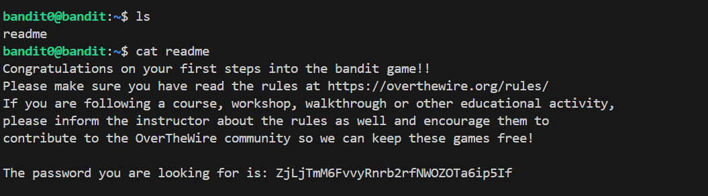

# 🎯 Bandit Level 0


## 📌 END goal: Tìm key bị giấu.
Đăng nhập vào hệ thống qua SSH với:
```
host: bandit.labs.overthewire.org
port: 2220
username: bandit0 
password: bandit0
```
---

## ⚙️ Cách thực hiện:
**Câu lệnh truy cập:**
*ssh username@remote*


```bash
ssh bandit0@bandit.labs.overthewire.org -p 2220
ls
cat readme
```
##### Key: `ZjLjTmM6FvvyRnrb2rfNWOZOTa6ip5If`



