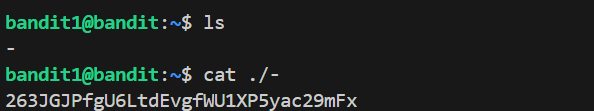

# 🎯 Bandit Level 0 --> Level 1

## 📌 END goal: Tìm key bị giấu.
*Lấy key: ZjLjTmM6FvvyRnrb2rfNWOZOTa6ip5If lấy được ở Level0 làm password cho Level 1*
```
host: bandit.labs.overthewire.org
port: 2220
username: bandit1
password: ZjLjTmM6FvvyRnrb2rfNWOZOTa6ip5If
```
---

## ⚙️ Cách thực hiện:
```bash
ssh bandit1@bandit.labs.overthewire.org -p 2220
ls
cat ./-
```
Khi ta ls để liệt kê các file ta thấy có 1 file tên '-' nhưng có 1 lưu ý rằng trong UNIX dấu '-' đươc hiểu là standard input (stdin)
==>Nên khi gõ ```cat -``` tức là muốn cat đọc từ bàn phím chứ không phải đọc file tên '-'

#### Key: `263JGJPfgU6LtdEvgfWU1XP5yac29mFx`

