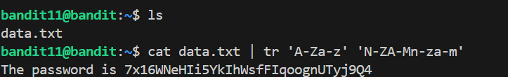

# 🎯 Bandit Level 11

## 📌 END goal: Tìm key bị giấu.
**Describe**: 
The password for the next level is stored in the file data.txt, where all lowercase (a-z) and uppercase (A-Z) letters have been rotated by 13 positions

```
host: bandit.labs.overthewire.org
port: 2220
username: bandit11
password: dtR173fZKb0RRsDFSGsg2RWnpNVj3qRr

```
---

## ⚙️ Cách thực hiện:
**Payload:**
```bash
ssh bandit11@bandit.labs.overthewire.org -p 2220
cat data.txt | tr 'A-Za-z' 'N-ZA-Mn-za-m'
```
---

Bài này ta sẽ được tìm hiểu về ROT13, 1 kĩ thuật mã hóa đơn giản thuộc nhóm "Caesar cypher" để che giấu tạm thời gói tin  

Cách hoạt động của nó là mỗi chữ cái sẽ được thay thế bằng chữ cái cách nó 13 vị trí và quay lại từ đầu nếu vượt quá 'z' hoặc 'Z'

**Ta có thể dùng lệnh ```tr``` để decode ROT13 trong terminal**, cụ thể:

1. ```tr```(transform) được dùng để xóa hoặc chuyển đổi kí tự đầu vào.
2. Syntax: ```bash tr [source_char_set] [des_char_set]```
   
==>Để chuyển các kí tự ROT13 'A-Z' về thường ta có tập des_char_set: 'N-ZA-M', tương tự với 'a-z'



### Key: 7x16WNeHIi5YkIhWsfFIqoognUTyj9Q4