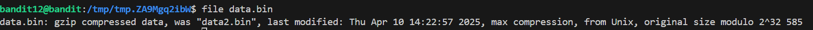

# 🎯 Bandit Level 12

## 📌 END goal: Tìm key bị giấu.
**Describe**: The password for the next level is stored in the file data.txt, which is a hexdump of a file that has been repeatedly compressed. For this level it may be useful to create a directory under /tmp in which you can work. Use mkdir with a hard to guess directory name. Or better, use the command “mktemp -d”. Then copy the datafile using cp, and rename it using mv (read the manpages!)


```
host: bandit.labs.overthewire.org
port: 2220
username: bandit12
password: 7x16WNeHIi5YkIhWsfFIqoognUTyj9Q4

```
---

## ⚙️ Cách thực hiện:
**Payload:**
```bash
ssh bandit12@bandit.labs.overthewire.org -p 2220


```

Trong describe của bài, có thể thấy Key đang nằm trong file data.txt đã bị nén nhiều lần và biểu diễn dưới dạng hexdump

(Nói dễ hiểu thì hexdump là cách biểu diễn binary data dưới dạng số hexa)

Chiến lược bây giờ là giải nén file về dạng có thể đọc được. Nhưng do không thể đọc giải nén khi file đang ở dạng hexdump  
nên ta cần chuyển nó về dạng file nhị phân trước khi thực hiện unzip.

1. Đầu tiên tạo 1 thư mục mới để tránh làm rối folder chính:  
    ```bash
    dir=$(mktemp -d)
    cd "$dir"
    ```
2. Copy file ```data.txt``` vào folder hiện tại đưa từ hexdump về dạng binary ban đầu với lệnh ```xxd -r```:  
    ```bash
    cp /home/bandit12/data.txt .
    xxd -r data.txt > data.bin
    ```
**Note:** ```xxd``` dùng để chuyển file bin thành dạng hexdump hoặc chuyển ngược lại với option ```-r```

3. Giải nén lặp: Đầu tiên dùng lệnh ```file data.bin``` để xác định định dạng file thực tế của data.bin ví dụ ở file data.bin ban đầu này đang ở dạng gzip



Sau đó tùy theo định dạng của nó ta sẽ unzip các file của nó, ta sẽ lặp lại các bước này cho đến khi định dạng file là ASCII hoặc UTP-8 text:
```bash
file data
mv data.bin data.gz
gunzip data.gz  #If file is gzip

file data
mv data data.bz2z
bunzip2 data.bz2  #If file is bzip2

file data
mv data data.tar
tar -xf data.tar #If file is tar
```

### Key: FO5dwFsc0cbaIiH0h8J2eUks2vdTDwAn

