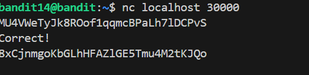

# 🎯 Bandit Level 14

## 📌 END goal: Tìm key bị giấu.
**Describe**: The password for the next level can be retrieved by submitting the password of the current level to port 30000 on localhost.

```
host: bandit.labs.overthewire.org
port: 2220
username: bandit14
password: MU4VWeTyJk8ROof1qqmcBPaLh7lDCPvS

```
---

## ⚙️ Cách thực hiện:
**Payload:**
```bash
ssh bandit14@bandit.labs.overthewire.org -p 2220
nc localhost 30000
```

Sử dụng ```nc``` để gửi dữ liệu tới localhost tại port 30000.



### Key: 8xCjnmgoKbGLhHFAZlGE5Tmu4M2tKJQo