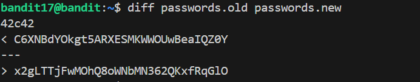

# 🎯 Bandit Level 17

## 📌 END goal: Key là dòng bị chỉnh sửa giữa 2 file .new & .old
**Describe**: There are 2 files in the homedirectory: passwords.old and passwords.new. The password for the next level is in passwords.new and is the only line that has been changed between passwords.old and passwords.new

```
host: bandit.labs.overthewire.org
port: 2220
username: bandit17
file private key: key_lv17 (file giữ RSA private key)

```
---

## ⚙️ Cách thực hiện:
**Payload:**
```bash
ssh  bandit17@bandit.labs.overthewire.org -p 2220 -i key_lv17
diff passwords.old passwords.new
```

### Key: x2gLTTjFwMOhQ8oWNbMN362QKxfRqGlO 


