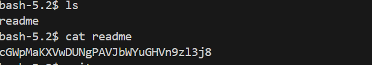

# 🎯 Bandit Level 18

## 📌 END goal: Key được lưu trong file readme nhưng file cấu hình .bashrc đã bị sửa để tự động log out khi vừa kết nối ssh
**Describe**: The password for the next level is stored in a file readme in the homedirectory. Unfortunately, someone has modified .bashrc to log you out when you log in with SSH.

```
host: bandit.labs.overthewire.org
port: 2220
username: bandit18
password: x2gLTTjFwMOhQ8oWNbMN362QKxfRqGlO

```
---

## ⚙️ Cách thực hiện:
**Payload:**
```bash
ssh -p 2220 bandit18@bandit.labs.overthewire.org -t "bash --noprofile --norc"
cat readme
```

**Các kiến thức cần biết:**  
-Khi đăng nhập SSH vào 1 tài khoản, hệ thống sẽ thực hiện các file cấu hình để khởi động shell:  
    +Các file ```/etc/profile```, ```~/.bash_profile```, ```~/.bash_login```, ```~/.profile``` sẽ chạy khi mở login shell
    +File ```~/.bashrc``` sẽ chạy khi mở interactive shell (đăng nhập và nhập lệnh qua terminal)

-Ta thực hiện bypass file ```.bashrc``` bằng lệnh:
```bash
ssh -p 2220 bandit18@bandit.labs.overthewire.org -t "bash --noprofile --norc"
```  
Lệnh này: SSH sẽ đăng nhập rồi gọi bash mới.  
+```--noprofile --norc``` sẽ bỏ qua mọi file cấu hình



### Key: cGWpMaKXVwDUNgPAVJbWYuGHVn9zl3j8