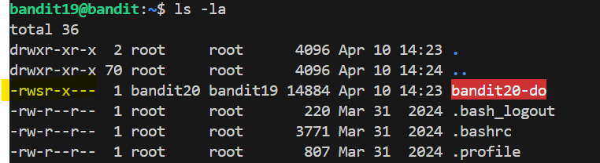
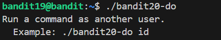

# 🎯 Bandit Level 19

## 📌 END goal: Lấy key trong ```/etc/bandit_pass/bandit20```, nhưng file này chỉ đọc được nếu có quyền của user ```bandit20```
**Describe**: To gain access to the next level, you should use the setuid binary in the homedirectory. Execute it without arguments to find out how to use it. The password for this level can be found in the usual place (/etc/bandit_pass), after you have used the setuid binary.

```
host: bandit.labs.overthewire.org
port: 2220
username: bandit19
password: cGWpMaKXVwDUNgPAVJbWYuGHVn9zl3j8

```
---

## ⚙️ Cách thực hiện:
**Payload:**
```bash
ssh -p 2220 bandit19@bandit.labs.overthewire.org
ls -la
./bandit20-do cat /etc/bandit_pass/bandit20
```

-Khi ta xem nội dung của thư mục home, thấy 1 file thực thi:  


Dấu ```s``` trong ```-rwsr-x---``` thể hiện đây là 1 **setuid binary**, tức là nó sẽ chạy với quyền của chủ sở hữu file (ở đây là bandit20), không phải user hiện tại

-Chạy thử ```./bandit20-do``` với không tham số ta được hướng dẫn:  


-Dùng câu lệnh ```./bandit20-do cat /etc/bandit_pass/bandit20``` để đọc key:  


### Key: 0qXahG8ZjOVMN9Ghs7iOWsCfZyXOUbYO