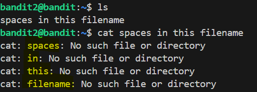
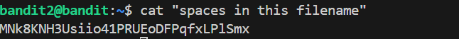

# 🎯 Bandit Level 2

## 📌 END goal: Tìm key bị giấu.
**Hint**: The password for the next level is stored in a file called spaces in this filename located in the home directory

```
host: bandit.labs.overthewire.org
port: 2220
username: bandit2
password: 263JGJPfgU6LtdEvgfWU1XP5yac29mFx
```
---

## ⚙️ Cách thực hiện:
**Payload:**
```bash
ssh bandit2@bandit.labs.overthewire.org -p 2220
ls
cat "spaces in this filename"
```

OR

```bash
ssh bandit2@bandit.labs.overthewire.org -p 2220
ls
cat spaces\ in\ this\ filename
```

Ở level này chứa 1 file có tên là "spaces in this filename" ta có thể thấy nó chứa 1 file có dấu cách  
Mà trong cấu trúc syntax của Linux có dạng: ```command [options] argument1 argument2```  
Vì thế nếu ta sử dụng ```cat spaces in this filename``` thì sẽ được hiểu là cat các file spaces, in, this, filename  



==>Ta có 2 cách để xử lý là dùng ```""``` để làm nó liền mạch hoặc ```\``` để escape mọi dấu space.

#### Key : MNk8KNH3Usiio41PRUEoDFPqfxLPlSmx

