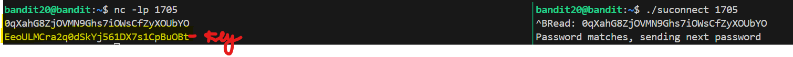

# 🎯 Bandit Level 20

## 📌 END goal: Lợi dụng 1 setuid binary có thể kết nối đến 1 port chỉ định trên localhost rồi đọc 1 dòng từ kết nối đó so sánh với password ở Level hiện tại để lấy Key
**Describe**: There is a setuid binary in the homedirectory that does the following: it makes a connection to localhost on the port you specify as a commandline argument. It then reads a line of text from the connection and compares it to the password in the previous level (bandit20). If the password is correct, it will transmit the password for the next level (bandit21).

```
host: bandit.labs.overthewire.org
port: 2220
username: bandit20
password: 0qXahG8ZjOVMN9Ghs7iOWsCfZyXOUbYO

```
---

## ⚙️ Cách thực hiện:
**Payload:**
```bash
ssh -p 2220 bandit20@bandit.labs.overthewire.org
tmux
nc -lp 1705
#Ctrl + b, sau đó % để chia dọc terminal
./suconnect 1705
#Ctrl + nút trái, để quay lại phiên của server
0qXahG8ZjOVMN9Ghs7iOWsCfZyXOUbYO
```

-Từ mô tả của level, đầu tiên ta có suy nghĩ:  
Khởi chạy 1 server trên 1 port bất kì trong local, server này sẽ gửi password của level20 (lv hiện tại)   
--->Chạy file ```suconnect``` với port đó   
--->Nếu đúng, server sẽ nhận được key.

### Các bước làm:
**-Bước 1:** Tạo 1 server bằng ```nc```:  
```bash
nc -lp 1705
```

**-Bước 2:** Dùng ``tmux`` để chia terminal thành 2 phiên, 1 phiên để chạy server, 1 phiên chạy file ``suconnect`` như hình dưới:   


### Key: EeoULMCra2q0dSkYj561DX7s1CpBuOBt