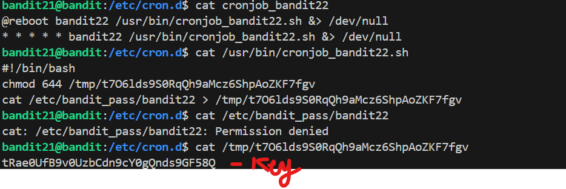

# 🎯 Bandit Level 21

## 📌 END goal: Tìm key bị giấu
**Describe**: A program is running automatically at regular intervals from cron, the time-based job scheduler. Look in /etc/cron.d/ for the configuration and see what command is being executed.


```
host: bandit.labs.overthewire.org
port: 2220
username: bandit21
password: EeoULMCra2q0dSkYj561DX7s1CpBuOBt

```
---

## ⚙️ Cách thực hiện:
**Payload:**
```bash
ssh -p 2220 bandit21@bandit.labs.overthewire.org
cd /etc/cron.d
cat cronjob_bandit22
cat /usr/bin/cronjob_bandit22.sh
cat /tmp/t7O6lds9S0RqQh9aMcz6ShpAoZKF7fgv
```

### Kiến thức cần biết: ###
-```cron``` là một **lập trình tác vụ** trong Linux/Unix, cho phép chạy các lệnh hoặc script vào thời điểm định sẵn.  
Ví dụ: Dùng cron để tự động sao lưu các dữ liệu mỗi ngày lúc 2h sáng
-```cron``` sử dụng các file ```crontab``` để định nghĩa các tác vụ cần chạy và thời gian chạy.  
    +```crontab``` viết tắt của ```cron table```. Đây là 1 file văn bản đơn giản định nghĩa thời gian thực thi và lệnh.
    +Một dòng trong ```crontab``` có dạng:
    ```bash
      * * * * * <command to execute>
      | | | | |
      | | | | day of the week (0–6) (Sunday to Saturday; 
      | | | month (1–12)             7 is also Sunday on some systems)
      | | day of the month (1–31)
      | hour (0–23)
      minute (0–59)
    ```

Tham khảo thêm ở đây: ```https://en.wikipedia.org/wiki/Cron```

-Bước 1: Vào thư mục chứa cron jobs: ```cd /etc/cron.d```   

-Bước 2: liệt kê các file có trong đó và thấy 1 file ```cronjob_bandit22```, đọc file này thấy nội dung:   
```bash
cat cronjob_bandit22
@reboot bandit22 /usr/bin/cronjob_bandit22.sh &> /dev/null
* * * * * bandit22 /usr/bin/cronjob_bandit22.sh &> /dev/null
```   

-Bước 3:Kiểm tra nội dung script ```cronjob_bandit22.sh``` ta thấy:
```bash
#!/bin/bash
chmod 644 /tmp/t7O6lds9S0RqQh9aMcz6ShpAoZKF7fgv
cat /etc/bandit_pass/bandit22 > /tmp/t7O6lds9S0RqQh9aMcz6ShpAoZKF7fgv
```

password của level22 được ghi vào file ```/tmp/t7O6lds9S0RqQh9aMcz6ShpAoZKF7fgv```



### Key: tRae0UfB9v0UzbCdn9cY0gQnds9GF58Q