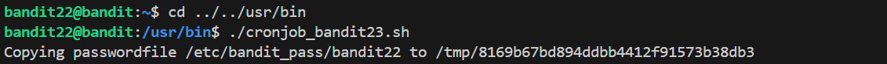

# 🎯 Bandit Level 22

## 📌 END goal: Tìm key bị giấu
**Describe**: A program is running automatically at regular intervals from cron, the time-based job scheduler. Look in /etc/cron.d/ for the configuration and see what command is being executed.


```
host: bandit.labs.overthewire.org
port: 2220
username: bandit22
password: tRae0UfB9v0UzbCdn9cY0gQnds9GF58Q

```
---

## ⚙️ Cách thực hiện:
**Payload:**
```bash
ssh -p 2220 bandit22@bandit.labs.overthewire.org
cd /etc/cron.d
ls
cat cronjob_bandit23
cat /usr/bin/cronjob_bandit23.sh
./cronjob_bandit23.sh
cat ../../../tmp/8169b67bd894ddbb4412f91573b38db3
```

-Tương tự với Level21, ở Level này khi đọc file chứa script:  
```bash
#!/bin/bash

myname=$(whoami)
mytarget=$(echo I am user $myname | md5sum | cut -d ' ' -f 1)

echo "Copying passwordfile /etc/bandit_pass/$myname to /tmp/$mytarget"

cat /etc/bandit_pass/$myname > /tmp/$mytarget
```

Ở script này sẽ lấy biến ```myname``` là ```bandit22``` sau đó biến ```mytarget``` sẽ có dạng ```I am user bandit22``` và được mã hóa md5

Lệnh ```cut -d ' ' -f 1``` sẽ tách chuỗi theo dấu cách và lấy chuỗi đầu tiên.   

-Chạy thử script:   


-Ta đọc file ```/tmp/8169b67bd894ddbb4412f91573b38db3``` có được key

### Key: tRae0UfB9v0UzbCdn9cY0gQnds9GF58Q