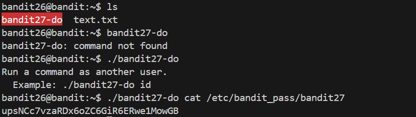

# 🎯 Bandit Level 26

## 📌 END goal: Tìm key bị giấu
**Describe**: Good job getting a shell! Now hurry and grab the password for bandit27!


```
host: bandit.labs.overthewire.org
port: 2220
username: bandit26
password: s0773xxkk0MXfdqOfPRVr9L3jJBUOgCZ

```
---

## ⚙️ Cách thực hiện:
**Payload:**
```bash
ssh -p 2220 bandit26@bandit.labs.overthewire.org
#Cho nhỏ terminal
:set shell=/bin/bash
:shell
ls
./bandit27-do cat /etc/bandit_pass/bandit27
```

-Bài này tổng hợp của mấy Level trước, khá đơn giản:



### Key: upsNCc7vzaRDx6oZC6GiR6ERwe1MowGB