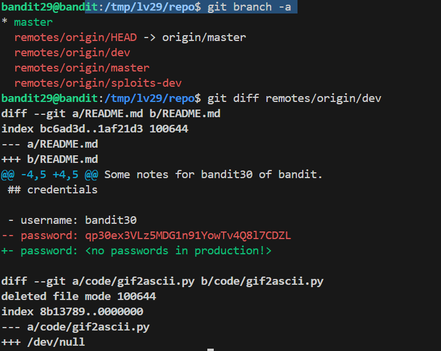

# 🎯 Bandit Level 29

## 📌 END goal: Tìm key bị giấu
**Describe**: There is a git repository at ssh://bandit29-git@localhost/home/bandit29-git/repo via the port 2220. The password for the user bandit29-git is the same as for the user bandit29.

Clone the repository and find the password for the next level.

```
host: bandit.labs.overthewire.org
port: 2220
username: bandit29
password: 4pT1t5DENaYuqnqvadYs1oE4QLCdjmJ7

```
---

## ⚙️ Cách thực hiện:
**Payload:**
```bash
ssh -p 2220 bandit29@bandit.labs.overthewire.org
mkdir /tmp/lv29
cd /tmp/lv29
git clone ssh://bandit29-git@localhost:2220/home/bandit29-git/repo
ls
cd repo
ls
cat README.md
git branch -a
git diff remotes/origin/dev
```

-Khi đọc file ```README.md``` thấy:
```bash
$ cat README.md
# Bandit Notes
Some notes for bandit30 of bandit.

## credentials

- username: bandit30
- password: <no passwords in production!>
```

-Ta đoán password đang ở trên 1 branch khác.
==>Dùng ```git branch -a``` để xem tất cả các nhanh của repo.

==>Sau đó dùng lệnh ```diff``` như level trước so sánh các nhánh đó với nhánh hiện tại cho đến khi có password.



### Key: qp30ex3VLz5MDG1n91YowTv4Q8l7CDZL