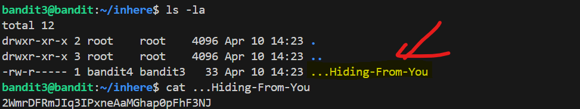

# 🎯 Bandit Level 3

## 📌 END goal: Tìm key bị giấu.
**Hint**: The password for the next level is stored in a hidden file in the inhere directory.

```
host: bandit.labs.overthewire.org
port: 2220
username: bandit3
password: MNk8KNH3Usiio41PRUEoDFPqfxLPlSmx

```
---

## ⚙️ Cách thực hiện:
**Payload:**
```bash
ssh bandit3@bandit.labs.overthewire.org -p 2220
ls
cd inhere
ls -la
cat ...Hiding-From-You
```
---

Khi ta sử dụng ```ls``` để đọc file của folder **inhere**, không thấy có file nào cả

==>Suy đoán rằng có file ẩn ở trong folder

==>Dùng option -la: ```ls -la```

==>Thấy có file "...Hiding-From-You"

#### Key: 2WmrDFRmJIq3IPxneAaMGhap0pFhF3NJ

