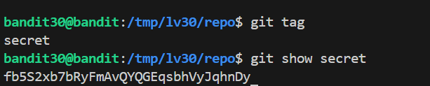

# 🎯 Bandit Level 30

## 📌 END goal: Tìm key bị giấu
**Describe**: There is a git repository at ssh://bandit30-git@localhost/home/bandit30-git/repo via the port 2220. The password for the user bandit30-git is the same as for the user bandit30.

Clone the repository and find the password for the next level.

```
host: bandit.labs.overthewire.org
port: 2220
username: bandit30
password: qp30ex3VLz5MDG1n91YowTv4Q8l7CDZL
```
---

## ⚙️ Cách thực hiện:
**Payload:**
```bash
ssh -p 2220 bandit30@bandit.labs.overthewire.org
mkdir /tmp/lv30
cd /tmp/lv30
git clone 
git clone ssh://bandit30-git@localhost:2220/home/bandit30-git/repo
ls
cd repo
ls
cat README.md
git log
git branch -a
git diff remotes/origin/master
git diff remotes/origin/HEAD 
git tag
git show secret
```

-Ở level này, ta không thấy bất kì dấu hiệu nào của việc key bị thay đổi trong branch chính hay ở branch khác, ta đoán password có thể đang 
nằm ở 1 tag nào đó trong git, sử dụng lệnh: ```git tag``` ta thấy tồn tại 1 tag tên secret, đọc nó bằng ```show``` ta lấy được key cần tìm: 



### Key: fb5S2xb7bRyFmAvQYQGEqsbhVyJqhnDy