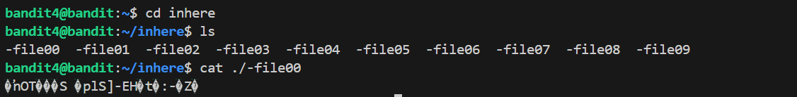
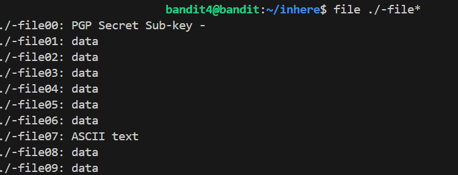

# 🎯 Bandit Level 4

## 📌 END goal: Tìm key bị giấu.
**Hint**: The password for the next level is stored in the only human-readable file in the inhere directory. Tip: if your terminal is messed up, try the “reset” command.

```
host: bandit.labs.overthewire.org
port: 2220
username: bandit4
password: 2WmrDFRmJIq3IPxneAaMGhap0pFhF3NJ

```
---

## ⚙️ Cách thực hiện:
**Payload:**
```bash
ssh bandit4@bandit.labs.overthewire.org -p 2220
ls
cd inhere
ls
file ./-file*
cat ./-file07

```
---

Sau khi ```cd inhere``` để chuyển tới folder inhere, ta dùng ```ls``` thấy trong inhere có 7 file lần lượt là:

-file00, file01,..., file09.

Thử đọc 1 file trong này: ```cat ./-file00``` thấy nó có dạng mã hóa không đọc được



**Sử dụng command ```file ./-file*``` để xác định file nào có thể đọc được(readable)**



==>Ta thấy chỉ có 1 file duy nhất -file07 là ở dạng ASCII
==>Dùng cat để đọc nó.

#### Key: 4oQYVPkxZOOEOO5pTW81FB8j8lxXGUQw
