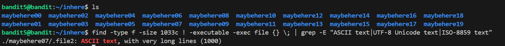

# 🎯 Bandit Level 5

## 📌 END goal: Tìm key bị giấu.
**Describe**: The password for the next level is stored in a file somewhere under the inhere directory and has all of the following properties:

human-readable  
1033 bytes in size  
not executable  

```
host: bandit.labs.overthewire.org
port: 2220
username: bandit5
password: 4oQYVPkxZOOEOO5pTW81FB8j8lxXGUQw

```
---

## ⚙️ Cách thực hiện:
**Payload:**
```bash
ssh bandit5@bandit.labs.overthewire.org -p 2220
ls
cd inhere
ls
find . -type f -size 1033c ! -executable -exec file {} \; | grep -E "ASCII text|UTF-8 Unicode text|ISO-8859 text"
cat ./maybehere07/.file2
```

---

Sau khi ta cd tới folder inhere, thử ls đọc các file, folder có trong inhere thấy có 20 folder trong đây, để tìm được file nào  
thỏa mãn là file **human-readable, 1033 byte, not executable**, ta dùng lệnh ```find``` để tìm file cùng với các option:

1. ```-type f``` để tìm các file thường có trong các folder.
2. ```-size 1033c``` tìm các file có kích thước 1033 byte.
3. ```! -executable``` các file không có quyền thực thi (not executable)
4. ```-exec file {} \; | grep -E "ASCII text|UTF-8 Unicode text|ISO-8859 text"```: Dùng để lọc các file có thể đọc được.

Cụ thể: ```-exec file {} \``` sẽ thực hiện lệnh ```file``` với từng file thỏa mãn các điều kiện trước đó.

```| grep -E "ASCII text|UTF-8 Unicode text|ISO-8859 text"``` : Lọc các file có chứa nội dung dạng human-readable.



Ta xác định được file cần tìm là: ./maybehere07/.file2

### Key: HWasnPhtq9AVKe0dmk45nxy20cvUa6EG
