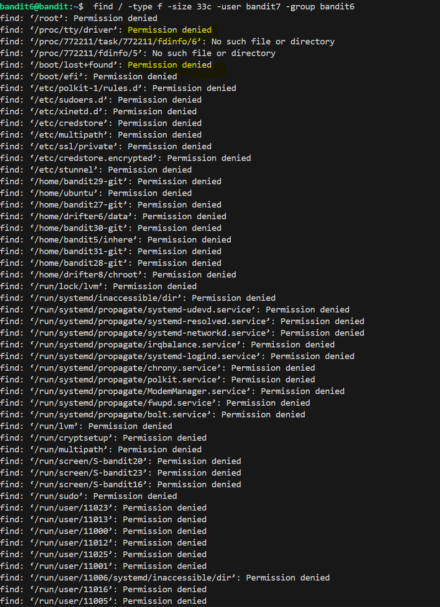
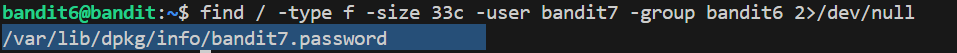

# 🎯 Bandit Level 6

## 📌 END goal: Tìm key bị giấu.
**Describe**: The password for the next level is stored somewhere on the server and has all of the following properties:

owned by user bandit7

owned by group bandit6

33 bytes in size


```
host: bandit.labs.overthewire.org
port: 2220
username: bandit6
password: HWasnPhtq9AVKe0dmk45nxy20cvUa6EG

```
---

## ⚙️ Cách thực hiện:
**Payload:**
```bash
ssh bandit6@bandit.labs.overthewire.org -p 2220
find / -type f -size 33c -user bandit7 -group bandit6 2>/dev/null
cat /var/lib/dpkg/info/bandit7.password
```

---
Theo mô tả của bài, file chứa key được lưu đâu đó trong server, nên ta sẽ bắt đầu tìm file từ thư mục gốc "/"

Thỏa mãn theo yêu cầu đề bài thì ta sẽ có câu lệnh:  
```find / -type f -size 33c -user bandit7 -group bandit6```  
nhưng có quá nhiều file lỗi được trả về:



==>Sử dụng thêm câu lệnh 2>/dev/null để chuyển hướng tất cả các lỗi **2>** vào /dev/null.  
Link tham khảo: [text](https://quantrimang.com/cong-nghe/dev-null-trong-linux-la-gi-165490)

Sau đó ta có được payload như sau: ```find / -type f -size 33c -user bandit7 -group bandit6 2>/dev/null```  



Đọc file đó và có được key.

### Key: morbNTDkSW6jIlUc0ymOdMaLnOlFVAaj