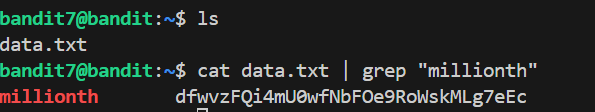

# 🎯 Bandit Level 7

## 📌 END goal: Tìm key bị giấu.
**Describe**: The password for the next level is stored in the file data.txt next to the word millionth


```
host: bandit.labs.overthewire.org
port: 2220
username: bandit7
password: morbNTDkSW6jIlUc0ymOdMaLnOlFVAaj

```
---

## ⚙️ Cách thực hiện:
**Payload:**
```bash
ssh bandit7@bandit.labs.overthewire.org -p 2220
ls
cat data.txt | grep "millionth"
```
---

Theo mô tả thì key nằm cạnh từ "millionth" nên ta sẽ sử dụng ```grep``` để tìm key.



### Key: dfwvzFQi4mU0wfNbFOe9RoWskMLg7eEc