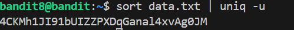

# 🎯 Bandit Level 8

## 📌 END goal: Tìm key bị giấu.
**Describe**: The password for the next level is stored in the file data.txt and is the only line of text that occurs only once


```
host: bandit.labs.overthewire.org
port: 2220
username: bandit8
password: dfwvzFQi4mU0wfNbFOe9RoWskMLg7eEc

```
---

## ⚙️ Cách thực hiện:
**Payload:**
```bash
ssh bandit8@bandit.labs.overthewire.org -p 2220
sort data.txt | uniq -u
```

Theo mô tả, key là 1 dòng xuất hiện trong data.txt duy nhất 1 lần

==>Ta sẽ sử dụng ```uniq -u``` để ghi lại những dòng xuất hiện 1 lần, nhưng do ```uniq``` chỉ đúng khi các dòng giống nhau được nằm liền nhau

==>Sử dụng ```sort``` trước đó.



### Key: 4CKMh1JI91bUIZZPXDqGanal4xvAg0JM