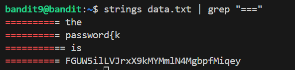

# 🎯 Bandit Level 9

## 📌 END goal: Tìm key bị giấu.
**Describe**: The password for the next level is stored in the file data.txt in one of the few human-readable strings, preceded by several ‘=’ characters.


```
host: bandit.labs.overthewire.org
port: 2220
username: bandit9
password: 4CKMh1JI91bUIZZPXDqGanal4xvAg0JM

```
---

## ⚙️ Cách thực hiện:
**Payload:**
```bash
ssh bandit9@bandit.labs.overthewire.org -p 2220
strings data.txt | grep "==="
```

Bài này giúp ta biết cách sử dụng **strings** để lọc ra các chuỗi có thể đọc được từ file data.txt.



### Key: FGUW5ilLVJrxX9kMYMmlN4MgbpfMiqey