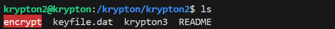
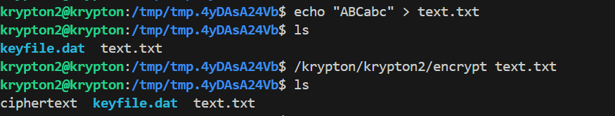

# 🔑 Krypton Level 2

## 📜 Mô tả đề bài
> The password for level 3 is in the file krypton3. It is in 5 letter group ciphertext. It is encrypted with a **Caesar Cipher**. Without any further information, this cipher text may be difficult to break. You do not have direct access to the key, however you do have access to a program that will encrypt anything you wish to give it using the key. If you think logically, this is completely easy.

---

## 🧭 Các bước thực hiện
1. **Bước 1**: Login ssh
```bash
ssh krypton2@krypton.labs.overthewire.org -p 2231
ROTTEN
```
2. **Bước 2**: Vào folder ```/krypton/krypton2``` đọc file ```README``` thấy nội dung:   
```text
Krypton 2

ROT13 is a simple substitution cipher.

Substitution ciphers are a simple replacement algorithm.  In this example
of a substitution cipher, we will explore a 'monoalphebetic' cipher.
Monoalphebetic means, literally, "one alphabet" and you will see why.

This level contains an old form of cipher called a 'Caesar Cipher'.
A Caesar cipher shifts the alphabet by a set number.  For example:

plain:  a b c d e f g h i j k ...
cipher: G H I J K L M N O P Q ...

In this example, the letter 'a' in plaintext is replaced by a 'G' in the
ciphertext so, for example, the plaintext 'bad' becomes 'HGJ' in ciphertext.

The password for level 3 is in the file krypton3.  It is in 5 letter
group ciphertext.  It is encrypted with a Caesar Cipher.  Without any 
further information, this cipher text may be difficult to break.  You do 
not have direct access to the key, however you do have access to a program 
that will encrypt anything you wish to give it using the key.  
If you think logically, this is completely easy.

One shot can solve it!

Have fun.

Additional Information:

The `encrypt` binary will look for the keyfile in your current working
directory. Therefore, it might be best to create a working direcory in /tmp
and in there a link to the keyfile. As the `encrypt` binary runs setuid
`krypton3`, you also need to give `krypton3` access to your working directory.

Here is an example:

krypton2@melinda:~$ mktemp -d
/tmp/tmp.Wf2OnCpCDQ
krypton2@melinda:~$ cd /tmp/tmp.Wf2OnCpCDQ
krypton2@melinda:/tmp/tmp.Wf2OnCpCDQ$ ln -s /krypton/krypton2/keyfile.dat
krypton2@melinda:/tmp/tmp.Wf2OnCpCDQ$ ls
keyfile.dat
krypton2@melinda:/tmp/tmp.Wf2OnCpCDQ$ chmod 777 .
krypton2@melinda:/tmp/tmp.Wf2OnCpCDQ$ /krypton/krypton2/encrypt /etc/issue
krypton2@melinda:/tmp/tmp.Wf2OnCpCDQ$ ls
ciphertext  keyfile.dat
```
3. **Bước 3**: Ở krypton2 có tổng cộng 4 file trong đó có 1 file SUID ```encrypt``` có thể đây là file để mã hóa ở level này:     


-Ta có đọc ở phần mô tả README rằng:    
```text
**The encrypt binary will look for the keyfile in your current working directory**
```

==>Caesar cypher ở challenge này hoạt động bằng cách đọc file ```keyfile.dat``` để biết k nội bộ rồi dùng k này mã hóa input đưa vào    

==>Chiến lược ở đây là ta sẽ đoán giá trị của k là bao nhiêu để có thể **decode** lấy được key ban đầu.   

-Ở đây ta thử lệnh:    
```bash
krypton2@krypton:/krypton/krypton2$ echo "AAAAAA" > text.txt
-bash: text.txt: Permission denied
```

-Có vẻ ở thư mục hiện tại không cho phép viết thêm bất kì file nào. Vì thế ta sẽ chuyển tới thư mục tmp như describe:     
```bash
mktemp -d
cd /tmp/tmp.4yDAsA24Vb
```

-Tiếp theo tạo 1 symlink tới ```keyfile.dat``` đồng thời cấp quyền cho thư mục hiện tại:    
```bash
ln -s /krypton/krypton2/keyfile.dat
chmod 777 .
```

-Tiếp theo tạo 1 file ```text.txt``` gồm vài chữ cái trong bảng chữ cái như ```ABCabc``` và chạy ```./encrypt``` để suy đoán ra k:    


==>Sau khi chạy xong có thêm 1 file mới ```ciphertext```, ta thấy từ ```ABCabc``` được encrypt thành ```MNOMNO```

==>k = 12 và được chuyển hết về dạng **UPPERCASE**

==>Dùng ```tr``` dịch toàn bộ A-Z lùi 12 kí tự:     
```bash
krypton2@krypton:/tmp/tmp.4yDAsA24Vb$ echo "OMQEMDUEQMEK" | tr 'A-Z' 'O-ZA-N'
CAESARISEASY
```

---

## 🧪 Payload 
```bash
cd /krypton/krypton2
ls
cat krypton3
mktemp -d
cd /tmp/...
echo "ABCabc" > text.txt
ln -s /krypton/krypton2/keyfile.dat
/krypton/krypton2/encrypt text.txt
echo "OMQEMDUEQMEK" | tr 'A-Z' 'O-ZA-N'
```

---

## 🧠 Kiến thức cần biết 
- Khái niệm/thuật toán: Caesar Cipher: Mỗi chữ cái trong plaintext được dịch k bước trong bảng chữ cái để tạo bảng mã ciphertext     
  +Công thức encrypt: C = (P + k) mod 26     
  +Công thức decrypt: P = (C - k + 26) mod 26     
*Với P là chữ cái gốc (plaintext), C là chữ cái mã hóa (ciphertext), k là số bước dịch*

==>ROT13 thực chất chỉ là 1 trường hợp đặc biệt của caesar cipher

- Lệnh hữu ích: ```tr``` là lệnh dịch ký tự theo ánh xạ 1-1.
**Syntax:**   
```bash
tr SET1 SET2
```

+Với SET1 là các ký tự cần thay thế (Ký tự hiện tại)   
+SET2 là các ký tự thay thế tương ứng (Sau khi decode)

---

## 🔑 Key
```text
CAESARISEASY
```
