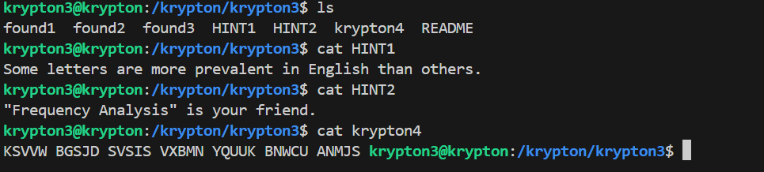
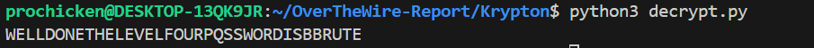

# 🔑 Krypton Level 2

## 📜 Mô tả đề bài
>  The password to the next level is found in the file ‘krypton4’. You have also found 3 other files. (found1, found2, found3)

---

## 🧭 Các bước thực hiện
1. **Bước 1**: Login ssh
```bash
ssh krypton3@krypton.labs.overthewire.org -p 2231
CAESARISEASY
```
2. **Bước 2**: Ta có được 2 thông tin quan trọng ở ```HINT1``` và ```HINT2```:    
   **Some letters are more prevalent in English than others.**      
   **"Frequency Analysis" is your friend.**      



==>Suy ra: Các files là English và nó đều được mã hóa từ cùng 1 key như file ```krypton4```

-Encrypted key: ```KSVVW BGSJD SVSIS VXBMN YQUUK BNWCU AANMJS```. Nếu ta có thể phân tích các tần suất trên các file ```found*```, ta có thể mapping nó để lấy được key cho level này.

3. **Bước 3**:     
-Tạo 1 file ```list_strings``` chứa các string của ```found*``` sau đó viết 1 script python đơn giản để đếm tần suất của các kí tự:
```bash
freq = {}
for char in 'ABCDEFGHIJKLMNOPQRSTUVWXYZ':
    freq[char] = 0
    
with open('/tmp/tmp.uhtsucCFD5/list_strings', 'r') as f:
    data = f.read()
    
for char in data:
    if char >= 'A' and char <= 'Z':
        freq[char] += 1
        
freq_list = []
for char in freq:
    freq_list.append((char, freq[char]))
    
freq_list.sort(key=lambda x : x[1], reverse=True)

for char, cnt in freq_list:
    print(f"{char} :   {cnt}")
```

```bash
mktemp -d
cd /tmp/tmp.*
cat /krypton/krypton3/found1 /krypton/krypton3/found2 /krypton/krypton3/found3 > list_strings
nano count_alpha.py
#Paste cái script trên vào
python3 count_alpha.py 
```

-Sau khi chạy script xong ta nhận được kết quả:    
```bash
S :   456
Q :   340
J :   301
U :   257
B :   246
N :   240
C :   227
G :   227
D :   210
Z :   132
V :   130
W :   129
M :   86
Y :   84
T :   75
X :   71
K :   67
E :   64
L :   60
A :   55
F :   28
I :   19
O :   12
H :   4
R :   4
P :   2
```

==>Ta tạo được 1 list tần suất kí tự trong ciphertext bài cho: **"SQJUBNCGDZVWMYTXKELAFIOHRP"**    

-Tiếp theo lên google tra ```frequence letter in english``` ta có được list: **"ETAOINSRHLDCUMFPGWYBVKXJQZ"**

4. **Bước 4:** Viết 1 script thay thế encrypt key để lấy key thật:    
```bash
import string

ciphertext = "KSVVWBGSJDSVSISVXBMNYQUUKBNWCUAANMJS"
#english_freq = "ETAOINSRHLDCUMFPGWYBVKXJQZ"
modified_freq = "EQTSORINHCLDUPMFWGYBKVXQJZ"
cipher_freq = "SQJUBNCGDZVWMYTXKELAFIOHRP"

key = ''
for i in ciphertext:
    l = cipher_freq.index(i)
    key += modified_freq[l]
    
print(key)
```



## 🔑 Key
```text
BBRUTE
```

## Có thể dùng: [quipquip](https://quipqiup.com/) để giải quyết bài này bằng cái bỏ hết các file vào đây.