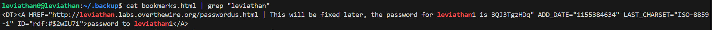

# 🧪 Leviathan Level 0 Writeup

> **Wargame:** Leviathan – OverTheWire  
> **Level:** leviathan0 → leviathan1  
> **Target:** Tìm mật khẩu cho user `leviathan1`

---

## 🖥️ SSH Đăng nhập

```bash
ssh leviathan0@leviathan.labs.overthewire.org -p 2223
Password: leviathan0
```

## 🔎 Cách thực hiện:   
**Payload:**   
```bash
ls -la
cd .backup
ls
cat bookmarks.html | grep "leviathan"
```

-Khi ls -la ta thấy có 1 file ```.backup``` khá khả nghi, cd tới đó và thấy 1 file ```bookmark.html```  đọc file để lấy key.



### Key: 3QJ3TgzHDq