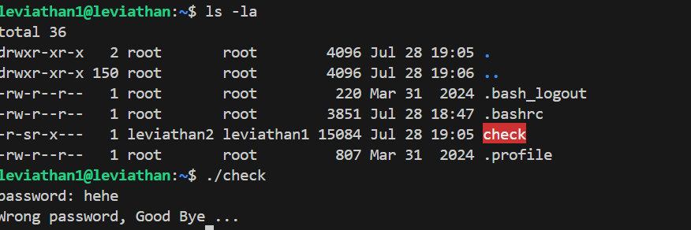
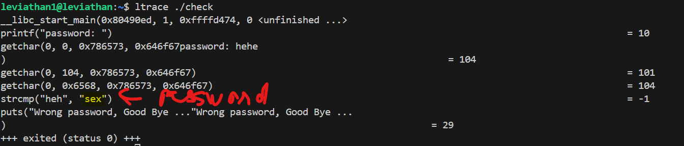
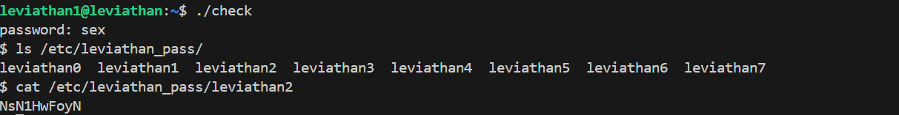

# 🧪 Leviathan Level 0 Writeup

> **Wargame:** Leviathan – OverTheWire  
> **Level:** leviathan1 → leviathan2  
> **Target:** Tìm mật khẩu cho user `leviathan2`

---

## 🖥️ SSH Đăng nhập

```bash
ssh leviathan1@leviathan.labs.overthewire.org -p 2223
Password: 3QJ3TgzHDq
```

## 🔎 Cách thực hiện:   
**Payload:**   
```bash
ls -la
./check
Ctrl+C
ltrace ./check
hehe
./check
sex
ls /etc/leviathan_pass/
cat /etc/leviathan_pass/leviathan2
```

### Kiến thức cần biết: ltrace là tool dùng để theo dõi các function call đến shared libraries khi 1 chương trình được chạy có thể thấy các lời gọi hàm, so sánh chuỗi và xử lý logic   


-Ta thấy ở server có 1 execute file với ```SUID```, thử chạy nó và bị bắt nhập pwd để chạy được:   
   

-Dùng ```ltrace ./check``` để xem các function call của file ```./check```:   
   

==>Ta biết được password để chạy file check là ```sex```, giờ chạy và lấy key thôi:   


### Key: NsN1HwFoyN