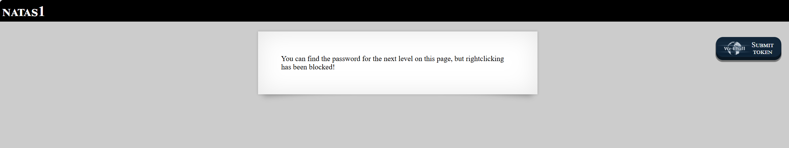

# Natas Level 1

## 🔑 Mục tiêu
Tìm password cho level tiếp theo.

**URL: http://natas1.natas.labs.overthewire.org**     
**Credential: natas1:*0nzCigAq7t2iALyvU9xcHlYN4MlkIwlq***

## 🛠️ Các bước thực hiện
1. Tổng quan trang web:


2. Ở lab này bị block right-click, để hiển thị source code ta dùng ```Ctrl+U``` là xong.

```bash
<!--The password for natas2 is TguMNxKo1DSa1tujBLuZJnDUlCcUAPlI -->
```

## 📌 Key: ```TguMNxKo1DSa1tujBLuZJnDUlCcUAPlI```