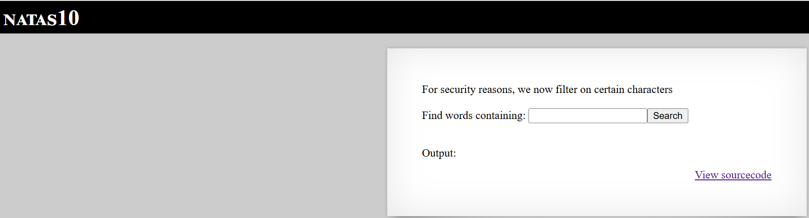

# Natas Level 10

## 🔑 Mục tiêu
Tìm password cho level tiếp theo.

**URL: http://natas10.natas.labs.overthewire.org**     
**Credential: natas10:*t7I5VHvpa14sJTUGV0cbEsbYfFP2dmOu***

## 🛠️ Các bước thực hiện
1. Tổng quan trang web:    


-Tương tự với level trước.

2. Xem source, ta được 1 đoạn mã PHP sau:   
```PHP
<?
$key = "";

if(array_key_exists("needle", $_REQUEST)) {
    $key = $_REQUEST["needle"];
}

if($key != "") {
    if(preg_match('/[;|&]/',$key)) {
        print "Input contains an illegal character!";
    } else {
        passthru("grep -i $key dictionary.txt");
    }
}
?>
```

==>Các kí tự như ```;```, ```|```, ```&``` đã bị filter.   

-Phân tích 1 chút về command ```grep -i $key dictionary.txt``` nếu biến ```$key``` có dạng ```1 string và 1 file``` thì sao.   

==>Nó sẽ kiếm đoạn string trong cả 2 file.

==>Thử bypass bằng payload: ```a /etc/natas_webpass/natas11```

==>Lấy được key


## 📌 Key: ```UJdqkK1pTu6VLt9UHWAgRZz6sVUZ3lEk```