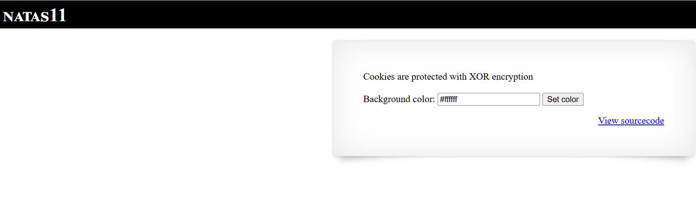
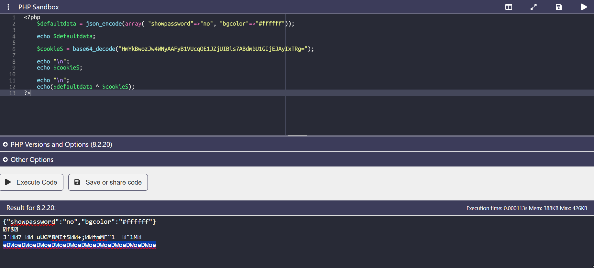

# Natas Level 11

## 🔑 Mục tiêu
Tìm password cho level tiếp theo.

**URL: http://natas11.natas.labs.overthewire.org**     
**Credential: natas11:*UJdqkK1pTu6VLt9UHWAgRZz6sVUZ3lEk***

## 🛠️ Các bước thực hiện
1. Tổng quan trang web:    


2.  Check source code, ta nhận được 1 đoạn PHP code:    
```PHP
<?

$defaultdata = array( "showpassword"=>"no", "bgcolor"=>"#ffffff");

function xor_encrypt($in) {
    $key = '<censored>';
    $text = $in;
    $outText = '';

    // Iterate through each character
    for($i=0;$i<strlen($text);$i++) {
    $outText .= $text[$i] ^ $key[$i % strlen($key)];
    }

    return $outText;
}

function loadData($def) {
    global $_COOKIE;
    $mydata = $def;
    if(array_key_exists("data", $_COOKIE)) {
    $tempdata = json_decode(xor_encrypt(base64_decode($_COOKIE["data"])), true);
    if(is_array($tempdata) && array_key_exists("showpassword", $tempdata) && array_key_exists("bgcolor", $tempdata)) {
        if (preg_match('/^#(?:[a-f\d]{6})$/i', $tempdata['bgcolor'])) {
        $mydata['showpassword'] = $tempdata['showpassword'];
        $mydata['bgcolor'] = $tempdata['bgcolor'];
        }
    }
    }
    return $mydata;
}

function saveData($d) {
    setcookie("data", base64_encode(xor_encrypt(json_encode($d))));
}

$data = loadData($defaultdata);

if(array_key_exists("bgcolor",$_REQUEST)) {
    if (preg_match('/^#(?:[a-f\d]{6})$/i', $_REQUEST['bgcolor'])) {
        $data['bgcolor'] = $_REQUEST['bgcolor'];
    }
}

saveData($data);


?>

<?
if($data["showpassword"] == "yes") {
    print "The password for natas12 is <censored><br>";
}

?>
```

-Đọc đoạn code trên thì ta thấy đây là 1 đoạn mã hóa cookie bằng XOR với key lấy từ nội bộ và ở Plaintext ban đầu có chứa giá trị ```showpassword``` quyết định xem password có được hiển thị hay không.    

-Có 1 đặc điểm ở XOR có thể cần biết ở đây là: ```P XOR K = C``` thì ```C XOR P = K``` (Các vị trí có thể hoán vị được)

-Từ đoạn code:   
```PHP
function saveData($d) {
    setcookie("data", base64_encode(xor_encrypt(json_encode($d))));
}
```
==> ```json_encode($d)``` tạo ra ```plaintext``` JSON

```xor_encrypt(...)``` mã hóa bằng xor ==> Tạo ra ```ciphertext``` thô (binary string) sau đó ```base64_encode``` để biến ciphetext từ binary thành ascii text để truyền qua header COOKIE.

==> Tức là ```json_encode($d)``` là P và ```base64_decode(cookie)``` là C 

-Thứ tự thực hiện như sau: Tìm K --> đổi cookie cho ```showpassword=true``` -->Lấy pass.

-Ta có được cookie ban đầu với: ```data=HmYkBwozJw4WNyAAFyB1VUcqOE1JZjUIBis7ABdmbU1GIjEJAyIxTRg%3D``` giá trị giống như đã được URL encode nên ta sẽ decode URL trước được giá trị:    
```bash
HmYkBwozJw4WNyAAFyB1VUcqOE1JZjUIBis7ABdmbU1GIjEJAyIxTRg=
```

==>Như thứ tự ở trên, để nhận được ```Key``` ta viết 1 đoạn PHP code đơn giản như sau:   
```PHP
<?php
    $defaultdata = json_encode(array( "showpassword"=>"no", "bgcolor"=>"#ffffff"));

    echo $defaultdata;

    $cookieS = base64_decode("HmYkBwozJw4WNyAAFyB1VUcqOE1JZjUIBis7ABdmbU1GIjEJAyIxTRg=");

    echo "\n";
    echo $cookieS;

    echo "\n";
    echo($defaultdata ^ $cookieS);
?>
 ```

==>Kết quả:    


-Giá trị ```key``` là: ```eDWo```

==>Lấy ```K XOR P``` nhưng P đã được đổi ```showpassword:yes``` để nhận cookie mới nào:     
```PHP
<?php
    $defaultdata = json_encode(array( "showpassword"=>"yes", "bgcolor"=>"#ffffff"));

    echo $defaultdata."\nn";
    
    $key = "eDWo";

    
    $out = "";
    for($i=0; $i < strlen($defaultdata); $i++){
    	$out .= $defaultdata[$i] ^ $key[$i % strlen($key)];
    }
    
    echo base64_encode($out);
?>
```

==>Ta được cookie mới có giá trị: ```HmYkBwozJw4WNyAAFyB1VUc9MhxHaHUNAic4Awo2dVVHZzEJAyIxCUc5```

==>Thay vào và lấy password.

## 📌 Key: ```yZdkjAYZRd3R7tq7T5kXMjMJlOIkzDeB```