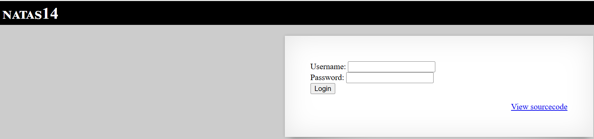
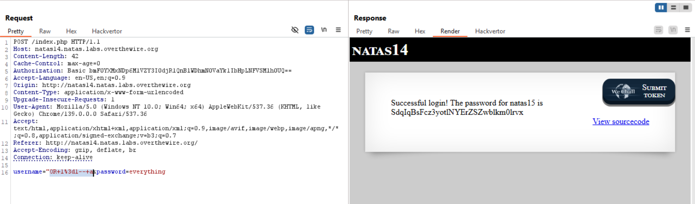

# Natas Level 14

## 🔑 Mục tiêu
Tìm password cho level tiếp theo.

**URL: http://natas14.natas.labs.overthewire.org**     
**Credential: natas14:*z3UYcr4v4uBpeX8f7EZbMHlzK4UR2XtQ***

## 🛠️ Các bước thực hiện
1. Tổng quan trang web:    


2. Source code:
```bash
<?php
if(array_key_exists("username", $_REQUEST)) {
    $link = mysqli_connect('localhost', 'natas14', '<censored>');
    mysqli_select_db($link, 'natas14');

    $query = "SELECT * from users where username=\"".$_REQUEST["username"]."\" and password=\"".$_REQUEST["password"]."\"";
    if(array_key_exists("debug", $_GET)) {
        echo "Executing query: $query<br>";
    }

    if(mysqli_num_rows(mysqli_query($link, $query)) > 0) {
            echo "Successful login! The password for natas15 is <censored><br>";
    } else {
            echo "Access denied!<br>";
    }
    mysqli_close($link);
} else {
?>
```

-Từ src ta có thể phân tích trang web này có thể dính SQL injection:
```bash
$query = "SELECT * from users where username=\"".$_REQUEST["username"]."\" and password=\"".$_REQUEST["password"]."\"";
```

-Dùng payload sau: ```username="OR 1=1-- a&password=everything``` 




## 📌 Key: ```SdqIqBsFcz3yotlNYErZSZwblkm0lrvx```