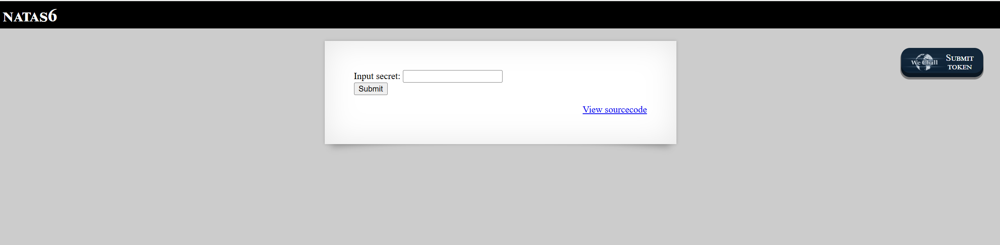

# Natas Level 6

## 🔑 Mục tiêu
Tìm password cho level tiếp theo.

**URL: http://natas6.natas.labs.overthewire.org**     
**Credential: natas6:*0RoJwHdSKWFTYR5WuiAewauSuNaBXned***

## 🛠️ Các bước thực hiện
1. Tổng quan trang web:    

   
2. Ở level này, cần nhập 1 *secret* để lấy key, khi check source code, ta lấy được 1 PHP code:     
```PHP
include "includes/secret.inc";

    if(array_key_exists("submit", $_POST)) {
        if($secret == $_POST['secret']) {
        print "Access granted. The password for natas7 is <censored>";
    } else {
        print "Wrong secret";
    }
    }
?>
```

-Ta có thể thấy dòng đầu sẽ làm 1 file ```/includes/secret.inc``` được import, giờ thử truy cập file này:    
```PHP
<?
$secret = "FOEIUWGHFEEUHOFUOIU";
?>
```

==>Lấy ```FOEIUWGHFEEUHOFUOIU``` để nhập vào và lấy password.

## 📌 Key: ```bmg8SvU1LizuWjx3y7xkNERkHxGre0GS```