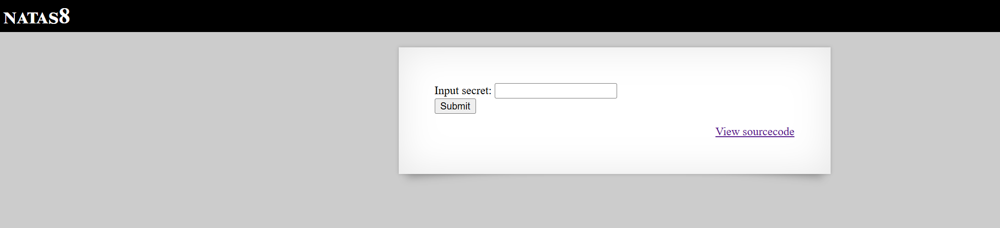

# Natas Level 8

## 🔑 Mục tiêu
Tìm password cho level tiếp theo.

**URL: http://natas8.natas.labs.overthewire.org**     
**Credential: natas8:*xcoXLmzMkoIP9D7hlgPlh9XD7OgLAe5Q***

## 🛠️ Các bước thực hiện
1. Tổng quan trang web:    


-->Khá giống với level trước đó đã làm.

2. Xem source code ta được 1 đoạn code PHP như sau:   
```PHP
<?

$encodedSecret = "3d3d516343746d4d6d6c315669563362";

function encodeSecret($secret) {
    return bin2hex(strrev(base64_encode($secret)));
}

if(array_key_exists("submit", $_POST)) {
    if(encodeSecret($_POST['secret']) == $encodedSecret) {
    print "Access granted. The password for natas9 is <censored>";
    } else {
    print "Wrong secret";
    }
}
?>
```

==>Đoạn code sẽ so sánh input của user với ```$encodedecret``` đã cho để quyết định có cho xem key không    
==>Giờ decode cái biến ```$encodeSecret``` là ok.   

-Để decode nó, đầu tiên ta cần biết function ```encodeSecret``` encode theo thứ tự sau:   
**```encode_base64 --> reverse code --> chuyển sang hex```**

==>Giờ ta viết 1 script python làm ngược lại:    
**```hex to bin --> reverse code --> decode_base64```**

```Python
import base64
import binascii

ecoded_secret = "3d3d516343746d4d6d6c315669563362"

#Hex to String
hex_decode = binascii.unhexlify(ecoded_secret).decode()
rev_str = hex_decode[::-1]
secret = base64.b64decode(rev_str).decode()

print(secret)
```

-Chạy script, ta nhận được string sau: ```oubWYf2kBq```, nhập nó và lấy key

```bash
Access granted. The password for natas9 is ZE1ck82lmdGIoErlhQgWND6j2Wzz6b6t
```

## 📌 Key: ```ZE1ck82lmdGIoErlhQgWND6j2Wzz6b6t```