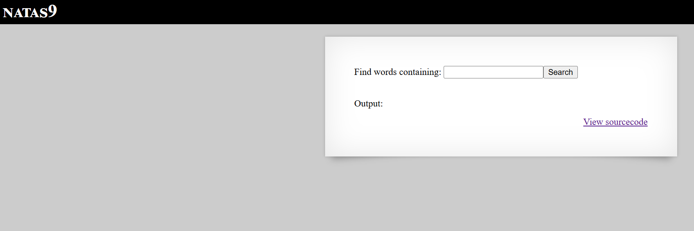

# Natas Level 9

## 🔑 Mục tiêu
Tìm password cho level tiếp theo.

**URL: http://natas9.natas.labs.overthewire.org**     
**Credential: natas9:*xcoXLmzMkoIP9D7hlgPlh9XD7OgLAe5Q***

## 🛠️ Các bước thực hiện
1. Tổng quan trang web:    


-Tương tự với level trước.

2. Xem source code, ta lấy được 1 đoạn PHP:   
```PHP
<?
$key = "";

if(array_key_exists("needle", $_REQUEST)) {
    $key = $_REQUEST["needle"];
}

if($key != "") {
    passthru("grep -i $key dictionary.txt");
}
?>
```

-Hàm ```passthru``` là hàm PHP dùng để thực thi lệnh hệ thống (system command) và in kết quả trực tiếp ra output.

-Phân tích chút thì biến ```key``` là input từ user nhập và không được filter mà được ném thẳng vào hàm ```passthru()```

==>Có thể dính ```Command Injection```.

-Thử với payload: ```; cat /etc/natas_webpass/natas10``` và nhận được key. 


## 📌 Key: ```t7I5VHvpa14sJTUGV0cbEsbYfFP2dmOu```